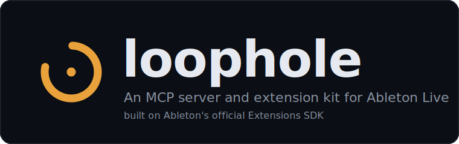
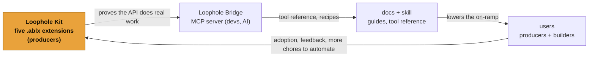
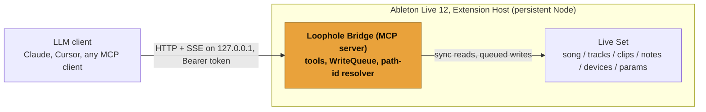

<p align="center">
  
</p>

<p align="center">
  <a href="https://github.com/OthmanAdi/loophole/actions/workflows/ci.yml"></a>
  <a href="LICENSE"></a>
  <a href="package.json"></a>
  <a href="https://modelcontextprotocol.io"></a>
  <a href="https://othmanadi.github.io/loophole/"></a>
  <a href="#build-wave-roadmap"></a>
</p>

**Loophole is an Ableton MCP server and extension kit, built so you can control Ableton Live from Claude or any LLM through one `.ablx` you install in Settings.** It runs _inside_ Live on Ableton's official Extensions SDK, which makes it **the first MCP server built on Ableton's official Extensions SDK.** No Remote Script, no AbletonOSC, no Max for Live.

Read the docs: [https://othmanadi.github.io/loophole/](https://othmanadi.github.io/loophole/)

Loophole is two things that feed each other:

- **The Loophole Kit:** a small set of focused Ableton extensions for the chores that eat studio time (arrangement, gain staging, set hygiene, scale, groove).
- **The Loophole Bridge:** an MCP server that lets an LLM (Claude, Cursor, any MCP client) read and edit your Live Set through the same official API the Kit uses.

The Kit proves the API does real work and reaches producers. The Bridge reaches the dev and AI crowd. They share one codebase and one install path.

> **Young, built in the open.** Loophole is a new project written against the Ableton Extensions SDK that launched 2026-06-02, with the whole monorepo (core, bridge, kit, docs, skill) on `main` and CI green. The SDK-free core, bridge, and extension logic is fully tested without Live; the in-Live behaviors (install, one-undo writes) are verified against the real Ableton runtime as the final step, using the [E2E checklist](packages/extension/README.md).



---

## Where everything lives

A map of the repo, so a stranger finds anything in one hop. Each piece links to its own README.

| Piece               | Package / path                                                               | One-line purpose                                                                                                                                          | README                                                       |
| ------------------- | ---------------------------------------------------------------------------- | --------------------------------------------------------------------------------------------------------------------------------------------------------- | ------------------------------------------------------------ |
| **Core**            | [`packages/core`](packages/core) · `@othmanadi/loophole-core`                | The SDK-free heart: the `LiveBridge` port, DTOs, `FakeLiveBridge`, and the pure transforms every extension and tool reuses. Fully tested without Live.    | [packages/core/README.md](packages/core/README.md)           |
| **Bridge**          | [`packages/mcp`](packages/mcp) · `@othmanadi/ableton-mcp`                    | The MCP server: `buildServer`, 12 deterministic tools, read-only resources, the one-undo guarantee. Transport-agnostic and SDK-free; not yet on npm.      | [packages/mcp/README.md](packages/mcp/README.md)             |
| **Kit (extension)** | [`packages/extension`](packages/extension) · `@othmanadi/loophole-extension` | The `.ablx` shell: the SDK adapter, `activate()`, five context-menu commands, and webviews. The only package that touches the SDK; private, never on npm. | [packages/extension/README.md](packages/extension/README.md) |
| **Docs**            | [`docs/`](docs)                                                              | Standalone Astro Starlight site: install guides, the auto-generated tool reference, recipes, and a build-your-own track.                                  | [docs/README.md](docs/README.md)                             |
| **Skill**           | [`skills/ableton-live`](skills/ableton-live)                                 | A thin developer-experience layer: `/doctor` prerequisite checks, `/setup` client config from `bridge.json`, and reusable Live-editing recipes.           | [skills/ableton-live/SKILL.md](skills/ableton-live/SKILL.md) |

The split is deliberate and the license forces it. `core` is the SDK-free heart, fully tested with no Live. `mcp` builds the MCP server on top of `core` and stays free of the beta SDK. `extension` is the deployment shell that packages to `.ablx`, and it is the only place the SDK is imported (in the adapter, the five command modules, and `activate()`), all behind the `LiveBridge` interface. That is why `core` and the whole server are testable without Live. See [CONTRIBUTING.md](CONTRIBUTING.md) for the `LiveBridge` rule and why the SDK never enters the source tree or the lockfile.

---

## What is actually new

There are already good ways to point an LLM at Ableton. They all reach Live from _outside_ it: a Python Remote Script over a socket (the original `ableton-mcp`), OSC via AbletonOSC, or a Max for Live device. Each works, and each carries the install friction and version fragility of the surface it rides on.

Loophole runs _inside_ Live, on Ableton's official Extensions SDK (announced 2026-06-02). That is the one genuinely unclaimed lane, and it is the only "first" Loophole claims:

> **The first MCP server built on Ableton's official Extensions SDK.**

What that buys a user:

- **One file.** Install a single `.ablx` in Live's Settings. No hidden Remote Scripts folder, no AbletonOSC, no Max for Live, no Developer Mode for a packaged build.
- **The supported surface.** A typed, first-party Node.js API instead of an unofficial socket or an OSC bridge.
- **Your stack.** TypeScript and Node, end to end.

That is the whole claim. Read the [prior art](#built-on-and-prior-art) section before you read "first" as anything bigger.

---

## How it works

The Bridge does not run as a standalone process you launch. It boots _inside_ Live's Extension Host (the persistent Node process Ableton owns) when the extension activates, and it binds an HTTP server to loopback. Your MCP client connects to that.



The server addresses objects by stable path ids (`track:2/clipslot:4`) that re-resolve on every call, so nothing host-local ever crosses the wire. Reads are synchronous. Every write serializes through one queue and is wrapped so that one tool call equals one Live undo step.

---

## Deterministic commands, a thin AI surface

The tools are the product. Each one is a deterministic command: validated input (Zod), a single well-defined effect on the Set, a structured result. The LLM only decides _which_ command to run and _with what arguments_. It never touches Live directly.

That split is the safety story and the test story. The deterministic layer is covered by fast unit and in-process integration tests that need no running Live. The stochastic layer (does the model pick the right tool for "shift this up an octave") is one small eval suite, run nightly, not on every commit. Most of the assertions are deterministic; the AI surface stays small on purpose.

---

## The Loophole Kit

Five extensions under one kit, all reachable from Live's right-click menu, each one undo step. The intelligence lives in [`core`](packages/core) and is fully tested without Live.

| Extension                              | What it does                                                                                                                                             |
| -------------------------------------- | -------------------------------------------------------------------------------------------------------------------------------------------------------- |
| **Session-to-Song Builder** (flagship) | Places your actual Session clips into a finished, named, colored, cue-pointed Arrangement. Aimed at loopitis: the most-cited reason tracks never finish. |
| **Gain Stage Doctor**                  | Renders pre-FX audio, measures peak/RMS/crest, writes a corrective mixer trim in one undo step. Measurement, not taste.                                  |
| **Set Janitor**                        | Whole-set hygiene sweep: empty tracks, unnamed clips, inconsistent colors, overrunning loops, fixed in one transaction.                                  |
| **Scale Lock**                         | Snaps MIDI to the scale already set in the Live Set, so the result is correct by construction.                                                           |
| **Humanize**                           | Nudges note timing, velocity, and probability off the grid for quick, musical passes.                                                                    |

**Beta limits, stated plainly.** The Extensions SDK is v1.0.0-beta: `renderPreFxAudio` is pre-FX and audio-tracks-only; device insertion is built-in Live devices only; there is no automation, CC, clip-gain, or routing API; extensions are user-invoked, never auto-triggered; assume 4/4 unless a scene signature is read. These shape what the Kit and the Bridge can and cannot do today. The full, per-extension limits are in the [Kit README](packages/extension/README.md).

---

## Quickstart

There is no published package or `.ablx` on npm yet, so install is from source. The path today:

1. **Clone and run the tests.** Rings 1 and 2 need no Live and no Ableton license. See [CONTRIBUTING.md](CONTRIBUTING.md).

   ```bash
   pnpm install --frozen-lockfile
   pnpm -r test
   ```

2. **Read the package READMEs** in the [map](#where-everything-lives) for the piece you care about: the [Bridge](packages/mcp/README.md) (the MCP server and its 12 tools), the [Kit](packages/extension/README.md) (the five extensions), or the [core](packages/core/README.md) (the SDK-free heart).
3. **Build the `.ablx` locally** if you have the SDK from Ableton's Beta Program: the local build and package steps are in the [Kit README](packages/extension/README.md). The SDK is a local-only prerequisite and never enters the tree.

When the Bridge ships, the install will be: install one `.ablx` in Live's Settings, copy the printed `127.0.0.1:PORT` and token, paste them into your MCP client (the [`/setup`](skills/ableton-live/SKILL.md) skill emits the config). That is the whole setup.

### Use it from your agent

The [`ableton-live`](skills/ableton-live/SKILL.md) skill is a thin `/doctor` + `/setup` + recipes layer over the Bridge. Add it to your agent with:

```bash
npx skills add OthmanAdi/loophole --skill ableton-live
```

---

## Monorepo layout

```
loophole/
├─ packages/
│  ├─ core/         @othmanadi/loophole-core        SDK-free heart: the LiveBridge port, DTOs, FakeLiveBridge, transforms
│  ├─ mcp/          @othmanadi/ableton-mcp          the Loophole Bridge: MCP server, 12 tools, resources (public)
│  └─ extension/    @othmanadi/loophole-extension   the Loophole Kit .ablx shell: SDK adapter + activate() + 5 commands (private)
├─ docs/            standalone Astro Starlight site: guides + auto-generated tool reference
├─ skills/
│  └─ ableton-live/ the /doctor + /setup + recipes developer-experience skill
├─ assets/          the brand SVG family (banner + one per package)
├─ pnpm-workspace.yaml
├─ tsconfig.base.json
└─ README.md  CONTRIBUTING.md  SECURITY.md  CODE_OF_CONDUCT.md  LICENSE
```

The [map above](#where-everything-lives) links each piece to its own README. The docs site lives under `docs/` as a standalone npm project (its own toolchain), not a pnpm workspace member, so the lean monorepo CI stays decoupled from the docs build.

---

## Built on, and prior art

Loophole stands on work that came first, and credits it.

- **[Ableton Extensions SDK](https://ableton.github.io/extensions-sdk/)** is the foundation. Loophole is an Extensions-SDK consumer, not affiliated with or endorsed by Ableton.
- **[ahujasid/ableton-mcp](https://github.com/ahujasid/ableton-mcp)** defined the category (Claude controlling Live via an MCP server) and carries the mindshare (around 2.6k stars). Loophole differs in one concrete way: it runs on the official SDK, so there is no Remote Script to install.
- **[Producer Pal](https://producer-pal.org/)** ([adamjmurray/producer-pal](https://github.com/adamjmurray/producer-pal)) is the craft bar: a polished, multi-LLM Max for Live MCP with its own docs site. Loophole treats it as the bar to match, not as an opponent, and differs on transport (official SDK vs Max for Live).
- **[ableton-js](https://github.com/leolabs/ableton-js)** and **[AbletonOSC](https://github.com/ideoforms/AbletonOSC)** are the Node and OSC prior art the older bridges stand on. Same idea, different (unofficial) surface.

What Loophole does **not** claim: not "first Ableton MCP" (ahujasid got there in 2025), not "first AI for Live" (Producer Pal exists), not "most complete coverage" (the API is beta with documented gaps). The architecture is the story, not the word "first."

---

## Build-wave roadmap

Sequenced so each wave ships standalone value and de-risks the next. Every wave below is **on `main` with CI green**; what remains is in-Live verification and the public launch.

| Wave   | Milestone                    | One line                                                                                                                                                                                                                                                   |
| ------ | ---------------------------- | ---------------------------------------------------------------------------------------------------------------------------------------------------------------------------------------------------------------------------------------------------------- |
| **W0** | Repo skeleton                | pnpm monorepo, strict TS base, ESLint + Prettier, Vitest, the `LiveBridge` seam + `FakeLiveBridge`, CI. Tests green with no Live.                                                                                                                          |
| **W1** | Scale Lock                   | First extension end to end: MIDI read-map-write, packaged `.ablx`, one undo reverts.                                                                                                                                                                       |
| **W2** | Humanize                     | Reuses the W1 MIDI loop; timing, velocity, and probability deviation.                                                                                                                                                                                      |
| **W3** | Gain Stage Doctor            | Render pre-FX audio, measure peak/RMS/crest, write a corrective trim in one undo.                                                                                                                                                                          |
| **W4** | Loophole Bridge v0.1         | The headline: in-process HTTP MCP server with 12 tools and read-only resources. Claude connects over loopback and edits a real clip.                                                                                                                       |
| **W5** | Session-to-Song Builder      | The flagship extension: turn a Session full of loops into a finished Arrangement in one transaction.                                                                                                                                                       |
| **W6** | Set Janitor                  | Broadest read pass: empties, bad names, colors, overruns, fixed in one transaction.                                                                                                                                                                        |
| **W7** | Docs site, registries, skill | Docs live at [othmanadi.github.io/loophole](https://othmanadi.github.io/loophole/) with an auto-generated tool reference and recipes; the `/doctor` + `/setup` skill installs via `npx skills add OthmanAdi/loophole --skill ableton-live`; registry prep. |

---

## Contributing, security, license

- **[CONTRIBUTING.md](CONTRIBUTING.md):** the `LiveBridge` rule, how to run the three test rings (rings 1 and 2 need no Ableton license), commit and PR expectations.
- **[SECURITY.md](SECURITY.md):** private disclosure path. The Bridge binds loopback only and requires a bearer token.
- **[CODE_OF_CONDUCT.md](CODE_OF_CONDUCT.md):** Contributor Covenant.
- **License:** [MIT](LICENSE).

Built by [Ahmad-Othman](https://github.com/OthmanAdi) (CodingWithAdi).
