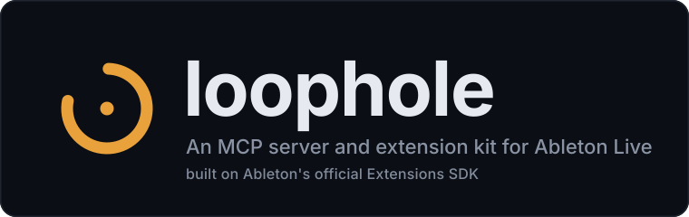
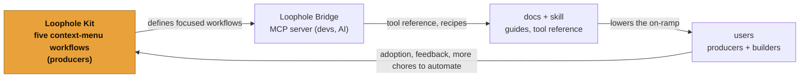
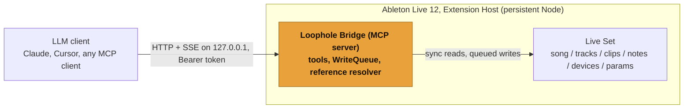

<p align="center">
  
</p>

<p align="center">
  <a href="https://github.com/OthmanAdi/loophole/actions/workflows/ci.yml"></a>
  <a href="LICENSE"></a>
  <a href="package.json"></a>
  <a href="https://modelcontextprotocol.io"></a>
  <a href="docs/"></a>
</p>

**Loophole is the source for an Ableton MCP library and extension kit, built so an MCP client can control Ableton Live through one locally packaged `.ablx`.** It is designed to run _inside_ Live on Ableton's official Extensions SDK, which makes it **the first MCP server built on Ableton's official Extensions SDK.** No Remote Script, no AbletonOSC, no Max for Live.

Read the versioned source documentation in [`docs/src/content/docs`](docs/src/content/docs). There is no published package, `.ablx`, CLI, or release yet.

Loophole is two things that feed each other:

- **The Loophole Kit:** a small set of focused Ableton extensions for the chores that eat studio time (arrangement, gain staging, set hygiene, scale, groove).
- **The Loophole Bridge:** an MCP server that lets an LLM (Claude, Cursor, any MCP client) read and edit your Live Set through the same official API the Kit uses.

The Kit defines focused producer workflows. The Bridge exposes the shared capabilities to MCP clients. They share one codebase and one local install path.

> **Verification boundary.** The SDK-free core and MCP library are exercised without Live. SDK typechecking, `.ablx` packaging, loading in Live, client connectivity, and real undo behavior are separate gates in the [E2E checklist](packages/extension/E2E_CHECKLIST.md). Unchecked gates are `NOT_RUN`; they are not implied by CI.


```mermaid
flowchart LR
    kit["Loophole Kit<br/>five context-menu workflows<br/>(producers)"]
    bridge["Loophole Bridge<br/>MCP server (devs, AI)"]
    docs["docs + skill<br/>guides, tool reference"]
    users["users<br/>producers + builders"]
    kit -- "defines focused workflows" --> bridge
    bridge -- "tool reference, recipes" --> docs
    docs -- "lowers the on-ramp" --> users
    users -- "adoption, feedback, more chores to automate" --> kit
    classDef accent fill:#E9A23B,stroke:#9A6A1A,color:#160F02,font-weight:bold;
    class kit accent;
```

---

## Where everything lives

A map of the repo, so a stranger finds anything in one hop. Each piece links to its own README.

| Piece               | Package / path                                                               | One-line purpose                                                                                                                                          | README                                                       |
| ------------------- | ---------------------------------------------------------------------------- | --------------------------------------------------------------------------------------------------------------------------------------------------------- | ------------------------------------------------------------ |
| **Core**            | [`packages/core`](packages/core) · `@othmanadi/loophole-core`                | The SDK-free heart: the `LiveBridge` port, DTOs, `FakeLiveBridge`, and pure transforms exercised without Live.                                            | [packages/core/README.md](packages/core/README.md)           |
| **Bridge**          | [`packages/mcp`](packages/mcp) · `@othmanadi/ableton-mcp`                    | The SDK-free MCP library: `buildServer`, 12 deterministic tools, read-only resources, and queued mutations. It is not published and has no supported CLI. | [packages/mcp/README.md](packages/mcp/README.md)             |
| **Kit (extension)** | [`packages/extension`](packages/extension) · `@othmanadi/loophole-extension` | The `.ablx` shell: the SDK adapter, `activate()`, five context-menu commands, and webviews. The only package that touches the SDK; private, never on npm. | [packages/extension/README.md](packages/extension/README.md) |
| **Docs**            | [`docs/`](docs)                                                              | Standalone Astro Starlight site: install guides, the auto-generated tool reference, recipes, and a build-your-own track.                                  | [docs/README.md](docs/README.md)                             |
| **Skill**           | [`skills/ableton-live`](skills/ableton-live)                                 | A thin developer-experience layer: `/doctor` checks, `/setup` merge-safe config output, and reusable Live-editing recipes.                                | [skills/ableton-live/SKILL.md](skills/ableton-live/SKILL.md) |

The split is deliberate and the license forces it. `core` is the SDK-free heart. `mcp` builds the MCP server on top of `core` and stays free of the beta SDK. `extension` is the deployment shell that packages to `.ablx`, and it is the only place the SDK is imported (in the adapter, the five command modules, and `activate()`), all behind the `LiveBridge` interface. That is why `core` and the server can be exercised without Live. See [CONTRIBUTING.md](CONTRIBUTING.md) for the `LiveBridge` rule and why the SDK never enters the source tree or the lockfile.

---

## What is actually new

There are already good ways to point an LLM at Ableton. They all reach Live from _outside_ it: a Python Remote Script over a socket (the original `ableton-mcp`), OSC via AbletonOSC, or a Max for Live device. Each works, and each carries the install friction and version fragility of the surface it rides on.

Loophole runs _inside_ Live, on Ableton's official Extensions SDK public beta. That is the one genuinely unclaimed lane, and it is the only "first" Loophole claims:

> **The first MCP server built on Ableton's official Extensions SDK.**

What that buys a user:

- **One file.** Install a single `.ablx` in Live's Settings. No hidden Remote Scripts folder, no AbletonOSC, no Max for Live, no Developer Mode for a packaged build.
- **The supported surface.** A typed, first-party Node.js API instead of an unofficial socket or an OSC bridge.
- **Your stack.** TypeScript and Node, end to end.

That is the whole claim. Read the [prior art](#built-on-and-prior-art) section before you read "first" as anything bigger.

---

## How it works

The Bridge does not run as a standalone process you launch. It boots _inside_ Live's Extension Host (the persistent Node process Ableton owns) when the extension activates, and it binds an HTTP server to loopback. Your MCP client connects to that.


```mermaid
flowchart LR
    client["LLM client<br/>Claude, Cursor, any MCP client"]
    subgraph host["Ableton Live 12, Extension Host (persistent Node)"]
        bridge["Loophole Bridge (MCP server)<br/>tools, WriteQueue, reference resolver"]
        set["Live Set<br/>song / tracks / clips / notes / devices / params"]
        bridge -- "sync reads, queued writes" --> set
    end
    client -- "HTTP + SSE on 127.0.0.1, Bearer token" --> bridge
    classDef accent fill:#E9A23B,stroke:#9A6A1A,color:#160F02,font-weight:bold;
    class bridge accent;
```

The server exposes opaque session references returned by current list and read calls. A reference is type-tagged, such as `lhref_trk_<opaque-token>`, but its token is not guessable or durable. Clients pass returned values through unchanged and list again after tracks, scenes, clips, devices, or parameters are structurally changed. Nothing host-local crosses the wire. Reads are synchronous and mutations serialize through one queue.

---

## Deterministic commands, a thin AI surface

The tools are the product. Each one is a deterministic command: validated input (Zod), finite and domain-checked numeric values, a single well-defined effect on the Set, and a structured result. The LLM only decides _which_ command to run and _with what arguments_. It never touches Live directly.

That split is the safety story and the test story. The deterministic layer is covered by fast unit and in-process integration tests that need no running Live. Model-choice evaluation (does the model pick the right tool for "shift this up an octave") is not part of the shipped repository yet, so Loophole makes no nightly-eval or model-quality claim. The AI surface stays small on purpose.

---

## The Loophole Kit

Five extensions under one kit, all registered from one extension entry point. Their undo behavior follows the operations the SDK can actually group. The intelligence lives in [`core`](packages/core) and is tested without Live; real menu registration and undo behavior remain Live-runtime gates.

| Extension                              | What it does                                                                                                                                                |
| -------------------------------------- | ----------------------------------------------------------------------------------------------------------------------------------------------------------- |
| **Session-to-Song Builder** (flagship) | Preflights a plan, then runs ordered clear, create, and populate phases. The receipt reports physical repetitions, cues, and the exact intended undo count. |
| **Gain Stage Doctor**                  | Analyzes pre-FX audio, shows a review plan, and writes non-silent trims only after explicit Apply.                                                          |
| **Set Janitor**                        | Whole-set hygiene sweep with opt-in deletes. Color enforcement requires a caller-supplied verified palette.                                                 |
| **Scale Lock**                         | Snaps MIDI to the scale already set in the Live Set, so the result is correct by construction.                                                              |
| **Humanize**                           | Nudges note timing, velocity, and probability off the grid for quick, musical passes.                                                                       |

**Beta limits, stated plainly.** The Extensions SDK is v1.0.0-beta: `renderPreFxAudio` is pre-FX and audio-tracks-only; device insertion is built-in Live devices only; there is no automation, CC, clip-gain, or routing API; extensions are user-invoked, never auto-triggered; assume 4/4 unless a scene signature is read. These shape what the Kit and the Bridge can and cannot do today. The full, per-extension limits are in the [Kit README](packages/extension/README.md).

---

## Quickstart

There is no published npm package or released `.ablx`, so install is from source. The path today:

1. **Clone and run the SDK-free tests.** Unit and in-process MCP integration tests need no Live or Ableton license. See [CONTRIBUTING.md](CONTRIBUTING.md).

   ```bash
   pnpm install --frozen-lockfile --ignore-scripts
   pnpm -r test
   ```

2. **Read the package READMEs** in the [map](#where-everything-lives) for the piece you care about: the [Bridge](packages/mcp/README.md) (the MCP server and its 12 tools), the [Kit](packages/extension/README.md) (the five extensions), or the [core](packages/core/README.md) (the SDK-free heart).
3. **Build the `.ablx` locally** if you have the SDK from Ableton's Beta Program: the local build and package steps are in the [Kit README](packages/extension/README.md). The SDK is a local-only prerequisite and never enters the tree.

Source users with access to Ableton's beta SDK can package one `.ablx` locally, install it in Live's Settings, then merge the client block emitted by [`/setup`](skills/ableton-live/setup.md). The `.ablx` and Live-runtime checks are not verified by this repository's SDK-free CI. Follow every gate in the [E2E checklist](packages/extension/E2E_CHECKLIST.md).

### Use it from your agent

The [`ableton-live`](skills/ableton-live/SKILL.md) skill is a thin `/doctor` + `/setup` + recipes layer over the Bridge. Add it to your agent with:

```bash
npx skills add OthmanAdi/loophole --skill ableton-live
```

---

## Monorepo layout

```
loophole/
├─ packages/
│  ├─ core/         @othmanadi/loophole-core        SDK-free heart: the LiveBridge port, DTOs, FakeLiveBridge, transforms
│  ├─ mcp/          @othmanadi/ableton-mcp          the Loophole Bridge: MCP server, 12 tools, resources (public)
│  └─ extension/    @othmanadi/loophole-extension   the Loophole Kit .ablx shell: SDK adapter + activate() + 5 commands (private)
├─ docs/            standalone Astro Starlight site: guides + auto-generated tool reference
├─ skills/
│  └─ ableton-live/ the /doctor + /setup + recipes developer-experience skill
├─ assets/          the brand SVG family (banner + one per package)
├─ pnpm-workspace.yaml
├─ tsconfig.base.json
└─ README.md  CONTRIBUTING.md  SECURITY.md  CODE_OF_CONDUCT.md  LICENSE
```

The [map above](#where-everything-lives) links each piece to its own README. The docs site lives under `docs/` as a standalone npm project (its own toolchain), not a pnpm workspace member, so the lean monorepo CI stays decoupled from the docs build.

---

## Built on, and prior art

Loophole stands on work that came first, and credits it.

- **[Ableton Extensions SDK](https://ableton.github.io/extensions-sdk/)** is the foundation. Loophole is an Extensions-SDK consumer, not affiliated with or endorsed by Ableton.
- **[ahujasid/ableton-mcp](https://github.com/ahujasid/ableton-mcp)** defined the category of controlling Live through an MCP server. Loophole differs in one concrete way: it is built for the official SDK, so there is no Remote Script to install.
- **[Producer Pal](https://producer-pal.org/)** ([adamjmurray/producer-pal](https://github.com/adamjmurray/producer-pal)) is the craft bar: a polished, multi-LLM Max for Live MCP with its own docs site. Loophole treats it as the bar to match, not as an opponent, and differs on transport (official SDK vs Max for Live).
- **[ableton-js](https://github.com/leolabs/ableton-js)** and **[AbletonOSC](https://github.com/ideoforms/AbletonOSC)** are the Node and OSC prior art the older bridges stand on. Same idea, different (unofficial) surface.

What Loophole does **not** claim: not "first Ableton MCP" (ahujasid got there in 2025), not "first AI for Live" (Producer Pal exists), not "most complete coverage" (the API is beta with documented gaps). The architecture is the story, not the word "first."

---

## Contributing, security, license

- **[CONTRIBUTING.md](CONTRIBUTING.md):** the `LiveBridge` rule, SDK-free validation, the separate Live-runtime checklist, and contribution expectations.
- **[SECURITY.md](SECURITY.md):** private disclosure path. The Bridge binds loopback only and requires a bearer token.
- **[CODE_OF_CONDUCT.md](CODE_OF_CONDUCT.md):** Contributor Covenant.
- **License:** [MIT](LICENSE).

Built by [Ahmad-Othman](https://github.com/OthmanAdi) (CodingWithAdi).
