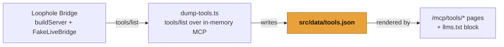

<p align="center">
  
</p>

# Loophole docs

The documentation site for [Loophole](../README.md), the Ableton MCP server and extension kit. It is a standalone [Astro Starlight](https://starlight.astro.build/) project that lives under `docs/`, with its own toolchain. It is **not** a pnpm workspace member, so the lean monorepo CI stays decoupled from the docs build.

Published at [https://othmanadi.github.io/loophole/](https://othmanadi.github.io/loophole/), a GitHub Pages project site. Each deploy is a manual maintainer action (see [Deploy](#deploy)).

This site documents a young project, built in the open on the Ableton Extensions SDK. The tool reference is generated from the running Loophole Bridge, the SDK-free layers it describes are tested without Live, and the in-Live behaviors are verified against real Ableton as the final step. Each page states the limit that applies to it.

---

## The site at a glance

The sidebar is defined in [`astro.config.mjs`](astro.config.mjs). Four sections, ordered easiest-first:

| Section                          | Covers                                                                                                                                                                    |
| -------------------------------- | ------------------------------------------------------------------------------------------------------------------------------------------------------------------------- |
| **Start here**                   | A single Quickstart: install the `.ablx`, connect a client, make one tool call.                                                                                           |
| **Loophole Bridge (MCP server)** | How it works, one install page per client (Claude Code, Claude Desktop, Cursor, other), the auto-generated tool reference, recipes, security, troubleshooting, changelog. |
| **Loophole Kit (extensions)**    | One page per extension (Scale Lock, Humanize, Gain Stage Doctor, Session to Song, Set Janitor), plus how to install a `.ablx`.                                            |
| **Build your own**               | Scaffold an extension, the API cheatsheet, webview UI, package and share.                                                                                                 |

Content is MDX under `src/content/docs/`, one file per sidebar entry. Diagrams are GitHub-native Mermaid rendered client-side by `astro-mermaid`, theme-bound to Starlight's light/dark toggle.

---

## The tool reference generates from the running server

The MCP tool reference is not written by hand. The running Loophole Bridge is the source of truth, and the docs are a projection of it.

[`scripts/dump-tools.ts`](scripts/dump-tools.ts) boots the real `buildServer` in-process against `FakeLiveBridge` (no Ableton, no Live, no socket), connects an in-memory MCP client, calls the standard `tools/list` endpoint, and writes the result to [`src/data/tools.json`](src/data/tools.json). The `/mcp/tools/*` pages and the `llms.txt` tool block both render from that file, so the docs can never drift from the server.



The dump runs automatically in `predev` and `prebuild`, never by hand. A stale committed `tools.json` fails CI: the [`docs-tools-drift`](../.github/workflows/docs-tools-drift.yml) workflow regenerates the file and runs `git diff --exit-code`. Add or change a tool in [`packages/mcp`](../packages/mcp), rebuild, and the reference follows on the next build.

---

## Run it locally

The docs are a standalone npm project, so use npm inside `docs/` (not pnpm). The tool dump imports `buildServer` from the **built** bridge bundle, so build `packages/mcp` first, from the monorepo root:

```bash
# 1. From the repo root: build the bridge so dump-tools can import it.
pnpm install --frozen-lockfile --ignore-scripts
pnpm --filter @othmanadi/ableton-mcp build

# 2. In docs/: install and build (prebuild regenerates tools.json from the server).
cd docs
npm install
npm run build
```

`npm run dev` serves the site with hot reload (it runs the same tool dump first via `predev`); `npm run preview` serves the built output. If you skip the bridge build, the dump exits with a clear "build the bridge first" message rather than a cryptic module error.

---

## Deploy

Deploy is manual. [`docs-deploy.yml`](../.github/workflows/docs-deploy.yml) is `workflow_dispatch` only: it publishes to GitHub Pages, but only when a maintainer triggers it from the Actions tab. Committing or merging the workflow never publishes anything. This matches the launch gate for the whole repo: nothing public ships without explicit approval.

The deploy job builds the bridge, regenerates `tools.json`, builds the site, and uploads the `docs/dist` artifact to Pages, so a published site always carries a fresh tool reference.

---

Part of the [Loophole](../README.md) monorepo. License: [MIT](../LICENSE).
