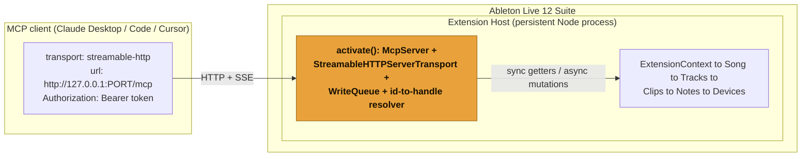

Loophole puts a small MCP server inside Ableton Live. Your MCP client talks to
it over loopback HTTP; the server talks to the Live Object Model through the
Extensions SDK. Nothing leaves your machine.

## The path from client to Set



The MCP server is constructed and connected once, inside the extension's
`activate()`, and lives for the whole Live session. It binds to `127.0.0.1`, so
it is off the network by construction.

## How an object is addressed

The Live Object Model hands out host-local handles that can go stale the moment
the tree changes. Those handles never cross the wire. Instead, every object has
a stable string path id, resolved fresh on every call:

```
song
song/tempo
track:2                      the third track
track:2/clipslot:4/clip      the clip in that session slot
track:2/device:1/param:6     that device's seventh parameter
```

If a path no longer resolves (a track was deleted, an index shifted), the tool
returns a clean `STALE_REFERENCE` result that tells the model to re-list and try
again. It never throws an opaque protocol error.

## The deterministic and AI split

The split is the point. The model decides intent; deterministic code does the
edit.

- **The model** reads the Set, reasons, and chooses which tool to call with
  which arguments.
- **The bridge** validates the arguments, runs one pure transform where music
  math is involved (snap to scale, humanize, gain math), and writes the result
  through one transaction.

The musical correctness lives in pure functions that have nothing to do with
Live and are tested exhaustively in CI. The model cannot corrupt a Set by being
creative: it can only call a tool, and the tool does one well-defined thing.

## One tool call is one undo

Every mutating tool runs its write inside a single `withinTransaction`, serial
through one write queue. So one tool call collapses to one entry in Live's undo
history. Humanize a clip, change your mind, press undo once: the clip is back.
This is the headline correctness property, and it holds for every write tool.

## The trust boundary

The bridge can rewrite your project, so it is locked down even on loopback:

- It binds to `127.0.0.1` only, never `0.0.0.0`.
- It checks the request `Origin` and rejects web origins (the DNS-rebinding
  guard).
- It requires a bearer token, written to the extension's storage directory on
  first run. A request without the token is rejected before the server sees it.

The token, the host handles, the internal transport, and your filesystem beyond
the extension's own temp and storage directories are never exposed to the model.
[Security](/mcp/security/) has the detail.
