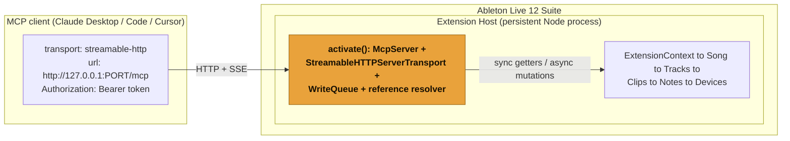

Loophole puts a small MCP server inside Ableton Live. Your MCP client talks to
it over loopback HTTP; the server talks to the Live Object Model through the
Extensions SDK. Nothing leaves your machine.

## The path from client to Set

```mermaid
flowchart LR
  subgraph Client["MCP client (Claude Desktop / Code / Cursor)"]
    C["transport: streamable-http<br/>url: http://127.0.0.1:PORT/mcp<br/>Authorization: Bearer token"]
  end
  subgraph Live["Ableton Live 12 Suite"]
    subgraph Host["Extension Host (persistent Node process)"]
      A["activate(): McpServer +<br/>StreamableHTTPServerTransport +<br/>WriteQueue + reference resolver"]
      LOM["ExtensionContext to Song to Tracks to<br/>Clips to Notes to Devices"]
      A -->|sync getters / async mutations| LOM
    end
  end
  C -->|HTTP + SSE| A
  classDef accent fill:#E9A23B,stroke:#9A6A1A,color:#160F02,font-weight:bold;
  class A accent;
```

The MCP server is constructed and connected once, inside the extension's
`activate()`, and lives for the whole Live session. It binds to `127.0.0.1`, so
it is off the network by construction.

## How an object is addressed

The Live Object Model hands out host-local handles. Those handles never cross the wire.
Instead, current list and read responses return opaque session references. Wire tags distinguish
tracks, scenes, cues, slots, clips, devices, and parameters:

`lhref_trk_<opaque-token>` shows the shape of a track reference, not a copyable value. Never
construct or parse one. Pass the exact returned string through unchanged. Re-list after structural
changes because references are session-scoped and intentionally not durable.

If a reference is stale or no longer identifies the same object, the tool
returns a clean `STALE_REFERENCE` result that tells the model to re-list and try
again. It never throws an opaque protocol error.

## The deterministic and AI split

The split is the point. The model decides intent; deterministic code does the
edit.

- **The model** reads the Set, reasons, and chooses which tool to call with
  which arguments.
- **The bridge** validates the arguments, rejects non-finite or out-of-domain numeric inputs before
  they reach Live, runs one pure transform where music
  math is involved (snap to scale, humanize, gain math), and writes the result
  through one transaction.

The transformation logic lives in pure functions that have nothing to do with Live and can be
tested without it. Tools still mutate a real Set when the user authorizes them, so preview the
target, use current references, and keep a saved copy for destructive experiments.

## Mutation and undo boundaries

Mutations serialize through one write queue. Simple setters are designed to initiate their write
inside one SDK transaction. Create then configure flows require separate mutations because the SDK
must first return the created object. SDK-free tests check intended transaction accounting; they do
not prove Live's undo history. Verify actual entries during the Live-runtime gate.

## The trust boundary

The bridge can rewrite your project, so it is locked down even on loopback:

- It binds to `127.0.0.1` only, never `0.0.0.0`.
- It checks the request `Origin` and rejects web origins (the DNS-rebinding
  guard).
- It requires a bearer token, written to the extension's storage directory on
  first run. A request without the token is rejected before the server sees it.

The token, the host handles, the internal transport, and your filesystem beyond
the extension's own temp and storage directories are never exposed to the model.
[Security](/mcp/security/) has the detail.
