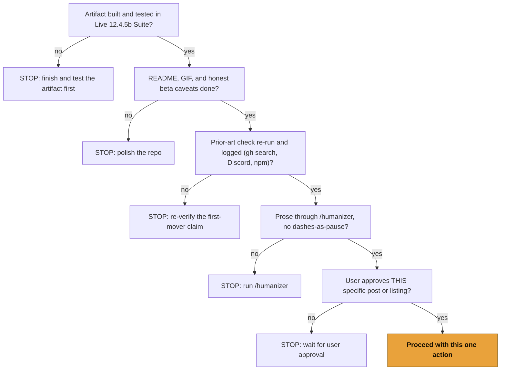

# Launch week playbook (prep only)

**Nothing in this file is executed without the user's explicit go-ahead for that specific post or listing.** This is a staged checklist, not a running schedule. Each row is one action, and each action is its own approval. No package is published, no registry entry is submitted, no post goes out, no repo setting is changed until the user says go for that one item.

## The per-action pre-flight gate (04 §3.1)

Run this gate before every single action below, not once for the week. Every public post is its own approval.

The gate is the precondition on every checkbox. A checkbox is allowed to be ticked only after all five gate questions pass for that row.

## Day 0 to 7 (04 §3.3)

The day labels are reproduced verbatim from the launch spec, including their em-dash separators, which the style contract scopes out of the no-dash rule for reproduced launch-week table labels. The action prose is the checklist.

### Day 0 (pre-launch): make the gate true

- [ ] Repos public under MIT.
- [ ] READMEs done, hero GIFs recorded, honest beta caveats stated up front.
- [ ] npm published (`@othmanadi/ableton-mcp`, with `mcpName` set and `@othmanadi/loophole-core` moved to devDependencies first; see `REGISTRY.md`).
- [ ] Docs site live (`docs.loophole.dev`, GitHub Pages canonical).
- [ ] Prior-art check re-run and logged (`gh search`, Discord, npm).
- [ ] All prose run through `/humanizer`.
- [ ] Verify `gh auth status` and `git config --get user.email` are the intended publishing identity.

### Day 1 — dev index

- [ ] `mcp-publisher publish` for `io.github.OthmanAdi/ableton` (official registry; npm prerequisite must already be done).
- [ ] Submit to Glama, PulseMCP, Smithery.
- [ ] Open a PR to `punkpeye/awesome-mcp-servers` (entry drafted in `AWESOME_ENTRIES.md`).
- [ ] X post: "SDK shipped today, working MCP bridge tonight."

### Day 2 — producer index

- [ ] Post the 2 to 3 strongest extensions in the Ableton Discord `#extensions-gallery` (15 to 30 second screen capture with the right-click menu visible, the `.ablx`, and a one-line what-it-does and what-it-does-not).
- [ ] Create and seed `awesome-ableton-extensions` (entry drafted in `AWESOME_ENTRIES.md`).
- [ ] Open a PR to `Sinzear/awesome-ableton`.
- [ ] Confirm or add GitHub topics (recommended set in `SEO.md`).

### Day 3 — recurring content

- [ ] dev.to tutorial #1 (build an extension), canonical pointing at the docs site.
- [ ] dev.to tutorial #2 (build the MCP server), canonical pointing at the docs site.
- [ ] Upload two YouTube demos.

### Day 4 — creator outreach

- [ ] DM 3 to 5 mid-tier Ableton educators a free `.ablx` (highest-variance hour).
- [ ] Answer Reddit and forum threads where an extension is the literal answer (native video, no cold link-drop).

### Day 5 — spike

- [ ] Show HN for the bridge (babysit ~3 hours, honest about beta).
- [ ] Reddit native video for the most demo-friendly extension.

### Day 6 to 7 — Product Hunt and consolidate

- [ ] Product Hunt self-hunt at 12:01 AM PT.
- [ ] Roll real proof (PH badge, creator demos) into the READMEs.
- [ ] Keep answering threads.

## After week one

Ship one extension every one to two weeks, re-run the scripted registry publish on each release, and keep the X build-log going. The compounding is in weeks 2 to 12, not day 1.

## What not to do (04 §3.5, hard)

- No fake anything: no bought stars, no sock-puppet upvotes, no invented testimonials.
- No cold link-dropping on Reddit.
- No Hacker News or Product Hunt before the indexes exist.
- No marketing voice anywhere; both audiences punish it.
- No overclaiming "first" beyond the one allowed claim (see `SEO.md` and the README prior-art section).
- No splitting the brand; one maker identity across every surface.
