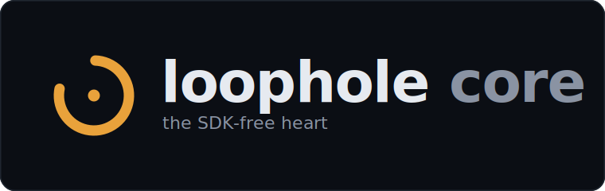
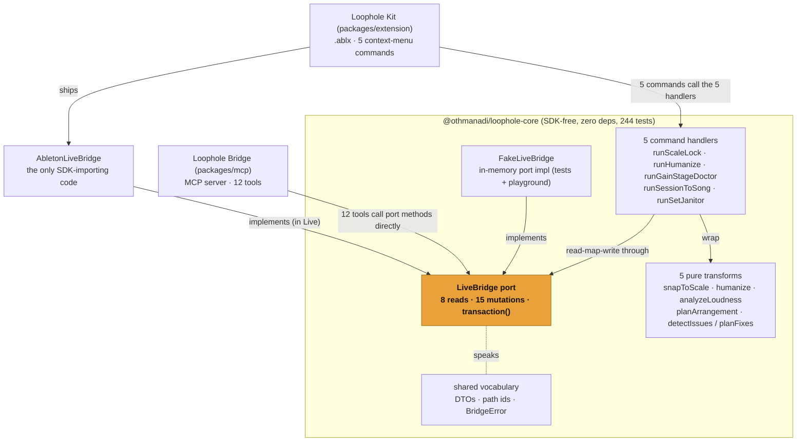

<p align="center">
  
</p>

**`@othmanadi/loophole-core` is the SDK-free heart that both the [Loophole Bridge](../mcp) and the [Loophole Kit extensions](../extension) are built on.** It is the one package with no Ableton SDK and no MCP SDK: just the `LiveBridge` port, the serializable DTOs, the stable path-id scheme, the typed error model, the five pure transforms, the five command handlers, and the in-memory `FakeLiveBridge`. Because everything intelligent lives here and nothing here touches Live, the whole package is tested on CI with no Ableton install: **244 tests across 14 files, all green without Live.**

This package is source-only (consumers bundle `src`), private, and never published to npm. It is part of the [Loophole](../../README.md) monorepo; start at the [root README](../../README.md) for the project map and the honest pitch.

---

## What this package is

Loophole splits cleanly so the SDK never enters the test path. `core` defines a single seam, the `LiveBridge` interface, and two things implement it: a `FakeLiveBridge` that lives here and reproduces the SDK contract in memory, and an `AbletonLiveBridge` adapter that lives in the [extension](../extension) and is the only code in the repo that imports Ableton's Extensions SDK. Everything above the seam (the [Bridge's](../mcp) tools, the Kit's transforms and handlers) is written once against the port and runs unchanged on either implementation.

That is why `core` carries the intelligence and stays fully testable without Live:

- **Zero runtime dependencies.** No `dependencies`, no `devDependencies`, no `peerDependencies`. It imports neither `@modelcontextprotocol/sdk` nor `@ableton-extensions/sdk`. The MCP server lives in the Bridge; the one SDK-touching adapter lives in the extension.
- **SDK-free by construction.** No `Handle`, no `bigint`, no SDK type ever appears in this package. Object references cross every boundary as string path ids, never as host handles.
- **Fully tested without Live.** The port, the fake, the transforms, and the handlers are covered by 244 fast tests that need no Ableton license and no running Live.

---

## How both consumers share one core

The Bridge and the extension consume `core` at two different layers, and the difference is deliberate. The Bridge's 12 tools sit on the `LiveBridge` **port** directly: each read tool calls one read method and shapes the result, each write tool calls one mutation method. The extension's five context-menu commands sit on the five **handlers**, the thin read-map-write glue that wraps the pure transforms. The extension also supplies the real port implementation (`AbletonLiveBridge`); `FakeLiveBridge` is the implementation the tests and the out-of-Live playground use.



Read the diagram as: the port is the pivot. The fake and the adapter implement it from below; the Bridge and the handlers consume it from above. The handlers exist only to let the extension's UI run a transform in one undo step; the Bridge does not use them, because an MCP tool is already a single deterministic call on the port.

---

## The `LiveBridge` port

`LiveBridge` is the entire contract between the tool and command layers and the Ableton object model. It mirrors the documented SDK shape but speaks plain DTOs and string path ids. Its contract rules are taken verbatim from the SDK semantics:

- **Most reads are synchronous** handle-backed getters that return a snapshot (`getSongOverview`, `listTracks`, `findTrack`, `listClips`, `getNotes`, `listScenes`). They open no transaction and add no undo step.
- **Two reads are async**: `listDeviceParams` and `getTrackMixer`. A parameter's live value comes from `DeviceParameter.getValue()`, the one async getter in the SDK, so these return a Promise. They are still pure reads: no transaction, no undo step.
- **Mutations are async** and each is one queued transaction, so one mutation is one undo (`setTempo`, `setTrackProps`, `setNotes`, `createTrack`, `createMidiClip`, `setClipProps`, `deleteTrack`, `deleteClip`, `createArrangementMidiClip`, `createArrangementAudioClip`, `clearClipsInRange`, `createCuePoint`, `setParam`, `insertDevice`, `renderTrack`).
- **`transaction(fn)`** groups several mutations into one user-facing undo step, mirroring the SDK's `withinTransaction`. The callback is synchronous and returns `Promise.all([...])`; any rejection rolls the whole group back, so one call stays one undo.

Mutations return the rich post-write DTO, so a tool can report the resulting state without a follow-up read.

---

## The path-id scheme

The real SDK addresses objects by `Handle` (`{ id: bigint }`), an opaque host-local reference that is not stable across sessions and must never be serialized. So `core` never lets a handle cross a boundary. Instead it uses stable, human-readable path ids: a `/`-joined chain of `kind:index` segments.

```text
track:2                     a track
track:2/clipslot:4          a Session clip slot
track:2/clipslot:4/clip     the clip inside that slot
track:2/clip:0              an Arrangement clip (by array index)
track:2/device:0/param:3    a device parameter
track:2/mixer/volume        the track's mixer volume (a writable parameter)
```

A `PathId` is a branded string, built only through `buildPath` or the typed builders (`trackId`, `clipSlotId`, `paramId`, and so on), so every id in the system is well-formed by construction. The ids are safe to send to an LLM and to JSON-serialize, and they re-resolve to a fresh handle on every call. The `AbletonLiveBridge` adapter keeps the private `Map<PathId, Handle>`; `core` only ever sees the strings.

---

## The typed error model

Every failure the bridge raises is a `BridgeError` carrying a stable, machine-checkable code and an actionable recovery hint. The Bridge maps these to MCP `{ isError: true }` results with the hint inlined, so the model can self-correct in one turn instead of seeing an opaque stack trace.

| Code              | Means                                                          | Recovery                                 |
| ----------------- | -------------------------------------------------------------- | ---------------------------------------- |
| `STALE_REFERENCE` | An id pointed at an object that no longer exists.              | Re-list and use a fresh id.              |
| `WRONG_TYPE`      | An id resolved to the wrong object kind for the call.          | Use an id from the matching list / read. |
| `BAD_INPUT`       | An argument was out of range or malformed before any SDK call. | Fix the argument.                        |
| `SDK_REJECTED`    | Live rejected an otherwise well-formed mutation.               | Adjust to what the API allows.           |
| `UNSUPPORTED`     | The operation is not available on this API version.            | Avoid it; it is a documented gap.        |

Constructor helpers (`staleReference`, `wrongType`, `badInput`, `sdkRejected`, `unsupported`) keep call sites to one line, and the guards `isBridgeError` / `isBridgeErrorOfCode` narrow at the boundary.

---

## The one-undo affordance

The headline correctness claim is that one tool call equals one transaction equals one Live undo. `FakeLiveBridge` makes that claim machine-checkable. It records how many undoable steps it has committed (one per standalone mutation, one per `transaction` call) and exposes the count as `transactionCount`. The ring-2 suite snapshots the count before a call and asserts it grew by exactly one.

The fake is faithful to the SDK contract: synchronous reads return cloned snapshots; the two value-reads are async; mutators are async; MIDI notes use read-map-assign; pitch and velocity are clamped to 0..127 on write; a bad id throws `STALE_REFERENCE` or `WRONG_TYPE`; `transaction` requires a synchronous callback and rolls back on any rejection. Its seeded fixtures (`seeded`, `withOneMidiClip`, `seededSession`, `seededMessySet`, `seededAudioTrack`) give each extension a realistic Set to run against with no Live.

---

## The transforms and handlers

The five transforms are pure: plain data in, plain data out, no I/O and no SDK. The five handlers are the thin read-map-write glue that runs each transform's writes inside one `transaction`. Where a handler needs something impure, it takes it as an injected callback rather than importing it, which is what keeps `core` dependency-free.

| Extension                   | Pure transform                                         | Handler              | Injected dependency                |
| --------------------------- | ------------------------------------------------------ | -------------------- | ---------------------------------- |
| **Scale Lock**              | `snapToScale`                                          | `runScaleLock`       | none                               |
| **Humanize**                | `humanize`                                             | `runHumanize`        | `rng` (for determinism)            |
| **Gain Stage Doctor**       | `analyzeLoudness` / `suggestTrimDb` / `dbToParamValue` | `runGainStageDoctor` | `DecodeWav` (no `node:fs` in core) |
| **Session-to-Song Builder** | `planArrangement`                                      | `runSessionToSong`   | none                               |
| **Set Janitor**             | `detectIssues` / `planFixes`                           | `runSetJanitor`      | none                               |

A handler reads the Set through the port, runs the pure transform on the snapshot, and writes the result back inside a single transaction, so one command is one undo across every clip or track it touches. A no-op (nothing selected) commits no transaction at all. Injecting `rng` and `DecodeWav` is the concrete proof that `core` stays pure: the randomness and the file decode are supplied by `activate()` in Live and by the tests on CI, never imported here.

---

## What is proven here, and what is not

`core` is the part of Loophole that is proven without Live: the port contract, the path-id and error models, the transforms, the handlers, and the one-undo accounting are all exercised by the 244-test suite on CI. The behaviors that need real Ableton live in the [extension](../extension): the `.ablx` install, the loopback bind, one undo per action inside Live, the Gain Stage Doctor dB-to-internal-value curve (W3), and the Session-to-Song create-then-populate undo grouping (W5). Those are verified against the real Ableton runtime as the final step, on the E2E checklist. None of them is a caveat on the logic in `core`; they mark the boundary where `core` stops and Live begins.

---

## Install and test from source

There is no published artifact. The package is built from source as part of the monorepo. From the repo root:

```bash
pnpm install --frozen-lockfile
pnpm --filter @othmanadi/loophole-core test
```

That runs the full suite with no Ableton license and no running Live. See [CONTRIBUTING.md](../../CONTRIBUTING.md) for the `LiveBridge` rule and the three test rings.

---

## Related packages

- **[`@othmanadi/ableton-mcp`](../mcp)**: the Loophole Bridge, the MCP server whose 12 tools sit on this port.
- **[`@othmanadi/loophole-extension`](../extension)**: the Loophole Kit `.ablx`, whose five commands call this package's handlers and which ships the one SDK-importing adapter.
- **[Loophole root README](../../README.md)**: the project map, the honest pitch, and the prior art.

---

Built by [Ahmad-Othman](https://github.com/OthmanAdi) (CodingWithAdi). License: [MIT](../../LICENSE).
