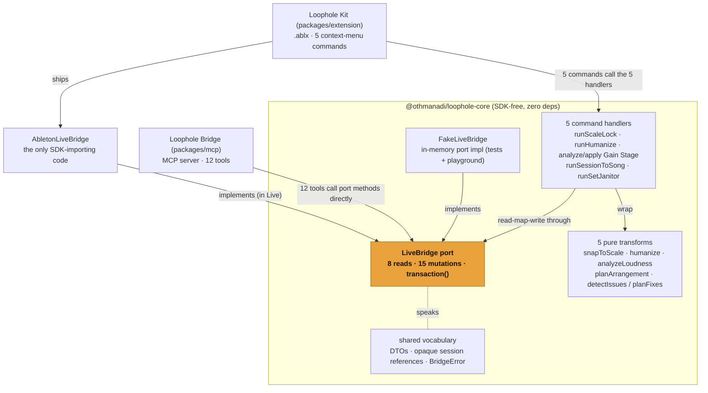

<p align="center">
  
</p>

**`@othmanadi/loophole-core` is the SDK-free heart that both the [Loophole Bridge](../mcp) and the [Loophole Kit extensions](../extension) are built on.** It contains the `LiveBridge` port, serializable DTOs, opaque session references, the typed error model, five pure transforms, five command handlers, and the in-memory `FakeLiveBridge`. Nothing here imports Ableton's SDK, so the package can be tested without an Ableton installation.

This package is source-only (consumers bundle `src`), private, and never published to npm. It is part of the [Loophole](../../README.md) monorepo; start at the [root README](../../README.md) for the project map and the honest pitch.

---

## What this package is

Loophole splits cleanly so the SDK never enters the test path. `core` defines a single seam, the `LiveBridge` interface, and two things implement it: a `FakeLiveBridge` that lives here and reproduces the SDK contract in memory, and an `AbletonLiveBridge` adapter that lives in the [extension](../extension) and is the only code in the repo that imports Ableton's Extensions SDK. Everything above the seam (the [Bridge's](../mcp) tools, the Kit's transforms and handlers) is written once against the port and runs unchanged on either implementation.

That is why `core` carries the intelligence and stays fully testable without Live:

- **Zero runtime dependencies.** No `dependencies`, no `devDependencies`, no `peerDependencies`. It imports neither `@modelcontextprotocol/sdk` nor `@ableton-extensions/sdk`. The MCP server lives in the Bridge; the one SDK-touching adapter lives in the extension.
- **SDK-free by construction.** No `Handle`, no `bigint`, and no SDK type appears in this package. Object references cross boundaries as opaque session references, never as host handles.
- **Tested without Live.** The port, fake, transforms, and handlers have fast tests that need no Ableton license and no running Live. Those tests do not prove `.ablx` loading or Live-runtime behavior.

---

## How both consumers share one core

The Bridge and the extension consume `core` at two different layers, and the difference is deliberate. The Bridge's 12 tools sit on the `LiveBridge` **port** directly: each read tool calls one read method and shapes the result, each write tool calls one mutation method. The extension's five context-menu commands sit on the five **handlers**, the thin read-map-write glue that wraps the pure transforms. The extension also supplies the real port implementation (`AbletonLiveBridge`); `FakeLiveBridge` is the implementation the tests and the out-of-Live playground use.


```mermaid
flowchart TB
    subgraph core["@othmanadi/loophole-core (SDK-free, zero deps)"]
        port["LiveBridge port<br/>8 reads · 15 mutations · transaction()"]
        vocab["shared vocabulary<br/>DTOs · opaque session references · BridgeError"]
        transforms["5 pure transforms<br/>snapToScale · humanize · analyzeLoudness<br/>planArrangement · detectIssues / planFixes"]
        handlers["5 command handlers<br/>runScaleLock · runHumanize · analyze/apply Gain Stage<br/>runSessionToSong · runSetJanitor"]
        fake["FakeLiveBridge<br/>in-memory port impl (tests + playground)"]
        handlers -- "read-map-write through" --> port
        handlers -- "wrap" --> transforms
        port -. "speaks" .- vocab
        fake -- "implements" --> port
    end

    bridge["Loophole Bridge (packages/mcp)<br/>MCP server · 12 tools"]
    ext["Loophole Kit (packages/extension)<br/>.ablx · 5 context-menu commands"]
    adapter["AbletonLiveBridge<br/>the only SDK-importing code"]

    bridge -- "12 tools call port methods directly" --> port
    ext -- "5 commands call the 5 handlers" --> handlers
    ext -- "ships" --> adapter
    adapter -- "implements (in Live)" --> port

    classDef accent fill:#E9A23B,stroke:#9A6A1A,color:#160F02,font-weight:bold;
    class port accent;
```

Read the diagram as: the port is the pivot. The fake and the adapter implement it from below; the Bridge and the handlers consume it from above. The handlers let the extension UI run shared transforms. The Bridge calls the port directly because each MCP tool is already a deterministic command.

---

## The `LiveBridge` port

`LiveBridge` is the entire contract between the tool and command layers and the Ableton object model. It mirrors the documented SDK shape but speaks plain DTOs and opaque session references.

- **Most reads are synchronous** handle-backed getters that return a snapshot (`getSongOverview`, `listTracks`, `findTrack`, `listClips`, `getNotes`, `listScenes`). They open no transaction and add no undo step.
- **Two reads are async**: `listDeviceParams` and `getTrackMixer`. A parameter's live value comes from `DeviceParameter.getValue()`, the one async getter in the SDK, so these return a Promise. They are still pure reads: no transaction, no undo step.
- **Mutations are async** and serialize through the write boundary. Simple mutations are designed to initiate their write inside one transaction.
- **`transaction(fn)` has a synchronous initiation boundary.** Work initiated after an `await` cannot be folded back into the earlier SDK transaction. The port does not promise database-style atomicity or rollback for asynchronous follow-up work.
- **Dependent Arrangement work uses three ordered mutation phases.** Session-to-Song preflights before writing, then clears the target range, creates physical clips and cues, and populates clip content, properties, and cue names. A no-op reports 0 intended undo entries, a cue-only build reports 2, and a build that clears, creates, and populates reports 3. Partial errors expose the exact `undoStepsToRestore`: 1 after clear followed by create failure, or 2 after clear and create followed by population failure.

Mutations return the rich post-write DTO, so a tool can report the resulting state without a follow-up read.

---

## Opaque session references

The real SDK addresses objects by `Handle` (`{ id: bigint }`), an opaque host-local value that must not cross the protocol boundary. Loophole exposes a separate opaque session reference for each object returned by a current list or read response.

References are type-tagged on the wire: `lhref_trk`, `lhref_scn`, `lhref_cue`, `lhref_slot`, `lhref_clip`, `lhref_dev`, and `lhref_param`. Explanatory text may show a shape such as `lhref_trk_<opaque-token>`, but clients must never invent or parse a token. Pass the returned string through unchanged.

References are session-scoped, not durable identifiers. Re-list after a structural change such as inserting, deleting, or moving a track, scene, clip, device, or parameter. A stale or mismatched reference fails instead of silently targeting the object that moved into an old position.

---

## The typed error model

Every failure the bridge raises is a `BridgeError` carrying a stable, machine-checkable code and an actionable recovery hint. The Bridge maps these to MCP `{ isError: true }` results with the hint inlined, so the model can self-correct in one turn instead of seeing an opaque stack trace.

| Code              | Means                                                          | Recovery                                  |
| ----------------- | -------------------------------------------------------------- | ----------------------------------------- |
| `STALE_REFERENCE` | A session reference expired or became stale.                   | Re-list and use the fresh returned value. |
| `WRONG_TYPE`      | A reference identifies the wrong object kind for the call.     | Use a value from the matching list/read.  |
| `BAD_INPUT`       | An argument was out of range or malformed before any SDK call. | Fix the argument.                         |
| `SDK_REJECTED`    | Live rejected an otherwise well-formed mutation.               | Adjust to what the API allows.            |
| `UNSUPPORTED`     | The operation is not available on this API version.            | Avoid it; it is a documented gap.         |

Constructor helpers (`staleReference`, `wrongType`, `badInput`, `sdkRejected`, `unsupported`) keep call sites to one line, and the guards `isBridgeError` / `isBridgeErrorOfCode` narrow at the boundary.

---

## Transaction accounting in the fake

`FakeLiveBridge` records transaction accounting so tests can verify intended write boundaries without claiming they have exercised Ableton. Simple mutations and explicitly grouped synchronous writes can be asserted independently from multi-phase commands such as Session-to-Song.

The fake models synchronous snapshot reads, async value reads, queued mutations, MIDI note replacement, validation, typed stale-reference failures, and explicit transaction boundaries. Its seeded fixtures give each extension a representative Set to run against without Live. It is a deterministic test double, not evidence that the Extension Host accepted a package or produced the same undo history.

---

## The transforms and handlers

The five transforms are pure: plain data in, plain data out, no I/O and no SDK. The five handlers are the thin read-map-write glue that runs each transform's writes inside one `transaction`. Where a handler needs something impure, it takes it as an injected callback rather than importing it, which is what keeps `core` dependency-free.

| Extension                   | Pure transform                                         | Handler                                           | Injected dependency                |
| --------------------------- | ------------------------------------------------------ | ------------------------------------------------- | ---------------------------------- |
| **Scale Lock**              | `snapToScale`                                          | `runScaleLock`                                    | none                               |
| **Humanize**                | `humanize`                                             | `runHumanize`                                     | `rng` (for determinism)            |
| **Gain Stage Doctor**       | `analyzeLoudness` / `suggestTrimDb` / `dbToParamValue` | `analyzeGainStageDoctor` / `applyGainStageDoctor` | `DecodeWav` (no `node:fs` in core) |
| **Session-to-Song Builder** | `planArrangement`                                      | `runSessionToSong`                                | none                               |
| **Set Janitor**             | `detectIssues` / `planFixes`                           | `runSetJanitor`                                   | none                               |

A handler reads the Set through the port, runs the pure transform on the snapshot, and applies the resulting plan through the port. Gain Stage Doctor deliberately separates read-only analysis from review and explicit apply; silent renders stay visible in the plan but are skipped, and malformed reviewed plans fail before any write. Session-to-Song uses ordered clear, create, and populate mutation phases because a delayed clear must finish before creation and the SDK must return created objects before population. Set Janitor groups value edits into one transaction and applies each structural deletion in its own transaction. A no-op commits no transaction. Randomness and WAV decoding are injected rather than imported, which keeps `core` dependency-free.

---

## What is proven here, and what is not

`core` proves only what can be exercised without Live: pure transforms, handler plans, reference validation, typed failures, and fake transaction accounting. The `.ablx` package, Extension Host activation, loopback server, real SDK mutations, and real undo history remain separate gates in the [E2E checklist](../extension/E2E_CHECKLIST.md). They are `NOT_RUN` until evidence is recorded there.

---

## Install and test from source

There is no published artifact. The package is built from source as part of the monorepo. From the repo root:

```bash
pnpm install --frozen-lockfile --ignore-scripts
pnpm --filter @othmanadi/loophole-core test
```

That runs the full suite with no Ableton license and no running Live. See [CONTRIBUTING.md](../../CONTRIBUTING.md) for the `LiveBridge` rule and the three test rings.

---

## Related packages

- **[`@othmanadi/ableton-mcp`](../mcp)**: the Loophole Bridge, the MCP server whose 12 tools sit on this port.
- **[`@othmanadi/loophole-extension`](../extension)**: the Loophole Kit `.ablx`, whose five commands call this package's handlers and which ships the one SDK-importing adapter.
- **[Loophole root README](../../README.md)**: the project map, the honest pitch, and the prior art.

---

Built by [Ahmad-Othman](https://github.com/OthmanAdi) (CodingWithAdi). License: [MIT](../../LICENSE).
