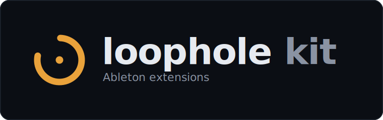
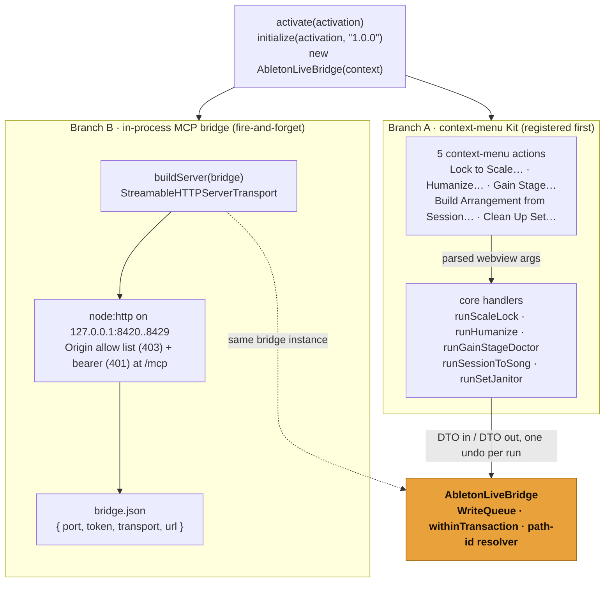

<p align="center">
  
</p>

<p align="center">
  <a href="https://github.com/OthmanAdi/loophole/actions/workflows/ci.yml"></a>
  <a href="../../LICENSE"></a>
  <a href="package.json"></a>
  <a href="https://modelcontextprotocol.io"></a>
  <a href="../../README.md#build-wave-roadmap"></a>
</p>

# Loophole Kit (`@othmanadi/loophole-extension`)

This package is the Ableton Live extension shell for Loophole. It packages to one `.ablx`
that you install in Live's Settings. When Live loads it, [`activate()`](src/extension.ts)
does two things in the same install:

1. starts the **Loophole Bridge** (the in-process MCP server from
   [`@othmanadi/ableton-mcp`](../mcp)) on loopback, so an LLM client can read and edit the
   Set, and
2. registers all five **Loophole Kit** context-menu extensions, each wired to a CI-tested
   pure transform in [`@othmanadi/loophole-core`](../core).

This is the only package that touches Ableton's Extensions SDK, and it is the only one that
cannot be tested in CI (there is no Ableton in CI, and the SDK is a local-only
prerequisite). Everything intelligent lives in [`core`](../core) and [`mcp`](../mcp), which
are fully tested without Live. See [CONTRIBUTING.md](../../CONTRIBUTING.md) for the
`LiveBridge` rule and why the SDK never enters the source tree or the lockfile. For the
prior art Loophole builds on (ahujasid/ableton-mcp, Producer Pal), see the root
[Built on, and prior art](../../README.md#built-on-and-prior-art).

Loophole is young, built in the open against the Ableton Extensions SDK that launched
2026-06-02, with the whole monorepo on `main` and CI green. This is the one package that
touches Ableton's runtime, so it is verified there as the final step. Every SDK call is typed
against the genuine extracted v1.0.0-beta.0 declarations and the local `tsconfig.live.json`
typecheck passes; the in-Live behaviors (the `.ablx` install, the loopback bind, one undo per
action, the W3 dB curve, the W5 create-then-populate undo grouping) run through the manual
`E2E_CHECKLIST.md`.

---

## Inside the Extension Host: what `activate()` wires

Live calls [`activate(activation)`](src/extension.ts) once, when the extension loads. It
constructs the one SDK-touching object and then takes two independent branches. The five
context-menu commands are registered **first**, synchronously, so they keep working even if
the bridge cannot bind a port; the MCP server then starts fire-and-forget, and any startup
failure is logged rather than thrown.



Both branches share the one `AbletonLiveBridge`: the Kit handlers reach it directly, the
Bridge tools reach it through `buildServer`. It is the single seam that holds a `Handle`,
serializes writes through one queue, and wraps each mutation so one action equals one Live
undo. The MCP bridge is documented in full in the [Bridge README](../mcp); this package is
where it is mounted.

---

## The five extensions

Each is one context-menu action over a pure transform. Right-click the listed object in
Live, pick the label, adjust the modal, apply. The whole effect is one undo step.

| Extension                   | Right-click label                 | Where                                      | What it does                                                                                                                |
| --------------------------- | --------------------------------- | ------------------------------------------ | --------------------------------------------------------------------------------------------------------------------------- |
| **Scale Lock**              | `Lock to Scale…`                  | a MIDI clip or clip-slot selection         | Snaps every note to the scale already set in the Set (snap up / down / nearest), and reports how many were off-scale.       |
| **Humanize**                | `Humanize…`                       | a MIDI clip or clip-slot selection         | Nudges note timing, velocity, and probability off the grid by a controlled amount, scaled to the grid set in Live.          |
| **Gain Stage Doctor**       | `Gain Stage…`                     | an audio track or an arrangement selection | Renders pre-FX audio, measures peak / RMS / crest, and writes a corrective mixer trim to a target staging level.            |
| **Session-to-Song Builder** | `Build Arrangement from Session…` | a Scene                                    | Recreates your Session clips in the Arrangement at the bars you lay out: named, colored, with cue points.                   |
| **Set Janitor**             | `Clean Up Set…`                   | a Scene                                    | Sweeps the whole Set for mess (empty tracks, placeholder names, off-palette colors, loop overruns) and fixes what you tick. |

### Beta limits

The Extensions SDK is v1.0.0-beta and the API has documented gaps. These shape what the Kit
can and cannot do today:

- **Scale Lock** snaps pitch to the scale already set in Live. It does not invent a key:
  with no scale set, it has nothing to snap to. It never touches timing. Microtonal and
  tuning-system scales are out of reach (the SDK exposes scale intervals as semitone offsets
  only).
- **Humanize** is random within grid-scaled bounds, so two runs differ by design. It edits
  MIDI notes only. Audio, automation, and MIDI CC are not exposed by the beta.
- **Gain Stage Doctor** measures **pre-FX** audio and works on **audio tracks only** (freeze
  or flatten MIDI first). The mixer volume control uses Live's internal value scale, so the
  tool maps your dB target onto that scale and shows the dB it is aiming for. The exact
  dB-to-internal-value curve is swept on a real build machine before the dB labels are
  trusted.
- **Session-to-Song Builder** **recreates** clips (it copies MIDI notes and references audio
  by file, plus name and color). Warp markers, clip envelopes, and follow actions do not
  carry over. It assumes 4/4 unless a scene signature is read. Locators are written as cue
  points (time plus name), not Live's colored section locators. The create-then-populate
  one-undo grouping is confirmed on a real build before release.
- **Set Janitor** is a structural hygiene sweep, not a clip renamer (Ableton's own RNMR does
  content-aware MIDI naming). Deletes are off by default and opt-in. It cannot relink missing
  samples, consolidate the project folder, or fix automation.

All five are **user-invoked only**: nothing runs unless you pick it from the menu. The
Bridge tools mounted by `activate()` carry their own beta limits (device insertion is
built-in Live devices only, and there is no automation, CC, clip-gain, or routing API); see
the [Bridge README](../mcp).

---

## One `.ablx`, not five (the packaging decision)

Loophole ships as **one** extension. `activate()` starts the Bridge and registers all five
context-menu actions from a single manifest and a single entry point (`dist/extension.js`).
That is the SDK's model (one manifest, one `activate`), it is one install for the user, and
it keeps the Bridge and the Kit on the same code and the same install path.

Splitting into five separate `.ablx` files is a supported packaging variant if you ever want
to ship a single extension on its own: give each its own `manifest.json` and an `activate()`
that registers just that one command (and, if you want the Bridge standalone, a sixth
manifest whose `activate()` only starts the server). Loophole does not do this today because
the single-install path is simpler and matches how the Kit and Bridge are used together.

---

## Local development (the SDK is a local-only prerequisite)

The committed package is **SDK-free**: there is no `@ableton-extensions/*` dependency in
`package.json` or the lockfile, and no copy of the SDK in the tree. The SDK is
non-redistributable beta software, so each licensee installs it locally from their own
download from the Ableton Beta Program. The build and package scripts below need it; the CI
gates (`typecheck`, `lint`, `test`, `build`) deliberately do not, and stay green with no SDK
present. See [CONTRIBUTING.md](../../CONTRIBUTING.md) for the full SDK-boundary rule.

### One-time setup

1. **Install the SDK and CLI tarballs you downloaded** (they are gitignored; nothing here is
   committed). From the repo root:

   ```bash
   pnpm add file:/abs/path/to/ableton-extensions-sdk-1.0.0-beta.0.tgz --filter @othmanadi/loophole-extension
   pnpm add -D file:/abs/path/to/ableton-extensions-cli-1.0.0-beta.0.tgz --filter @othmanadi/loophole-extension
   ```

   This rewrites `package.json` and `pnpm-lock.yaml` locally. **Do not commit those
   changes**: the published tree must stay SDK-free.

2. **Create the local typecheck config.** Copy the committed template to the gitignored real
   file and point its one `paths` entry at your machine's extracted SDK declarations:

   ```bash
   cp packages/extension/tsconfig.live.example.json packages/extension/tsconfig.live.json
   # then edit the "@ableton-extensions/sdk" path to your extracted .../dist/index.d.mts
   ```

   `tsconfig.live.json` is gitignored. It typechecks every SDK-facing file (the adapter, the
   five command modules, `activate()`) against the real types without committing the SDK.

### Verify, run, package

From the repo root, all via the package's local-only scripts. This package runs on Node
`>=24.14.1` (its `engines` floor; the CI matrix badge above shows the repo-wide 22 and 24
gates):

```bash
# Typecheck the SDK-facing code against the real extracted v1.0.0-beta.0 types.
# This is the accuracy proof; it passes with no Live present.
npx tsc -p packages/extension/tsconfig.live.json --noEmit

# Dev Mode: bundle and hot-load into a running Live (Settings → enable Dev Mode first).
pnpm --filter @othmanadi/loophole-extension run start:live

# Package the production .ablx (minified) for install / GitHub Release.
pnpm --filter @othmanadi/loophole-extension run package:live
```

- `build:live` runs the live typecheck and then the esbuild bundle (`build.ts`).
- `start:live` bundles and runs `extensions-cli run` (Dev Mode hot-load).
- `package:live` bundles `--production` and runs `extensions-cli package`, producing the
  `.ablx`.

The `.ablx` is distributed as a **GitHub Release artifact**, never committed (the SDK is
bundled inside it, which the license permits). `dist/`, `*.ablx`, `tsconfig.live.json`, and
any local SDK tarball under `vendor/` are gitignored.

---

## How the CI gates stay green without the SDK

| Gate        | This package                                                                                         |
| ----------- | ---------------------------------------------------------------------------------------------------- |
| `typecheck` | `tsc --noEmit` against `tsconfig.json`, which **excludes** every SDK-importing file.                 |
| `lint`      | `eslint .`; the SDK-importing files and the local-only `build.ts` are ignored in `eslint.config.js`. |
| `test`      | `vitest run --passWithNoTests` (the logic is tested in [`core`](../core) and [`mcp`](../mcp)).       |
| `build`     | a no-op placeholder; the real bundle is the local-only `build:live` / `package:live` above.          |

The SDK-facing files are proven instead by the local `tsconfig.live.json` typecheck against
the genuine extracted types. That, plus the [`core`](../core) and [`mcp`](../mcp) test
suites, is the full machine-checkable coverage available without Ableton; the in-Live step
runs through the `E2E_CHECKLIST.md`.

---

Built by [Ahmad-Othman](https://github.com/OthmanAdi) (CodingWithAdi). License:
[MIT](../../LICENSE).
