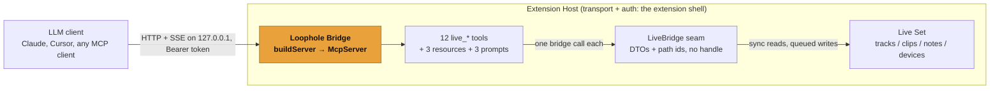

<p align="center">
  
</p>

<p align="center">
  <a href="https://github.com/OthmanAdi/loophole/actions/workflows/ci.yml"></a>
  <a href="https://modelcontextprotocol.io"></a>
  <a href="../../LICENSE"></a>
</p>

**`@othmanadi/loophole-core`'s sibling: the Loophole Bridge is the MCP server that lets an LLM read and edit a Live Set through the same official API the Loophole Kit uses.** It is the transport-agnostic, SDK-free package: you give `buildServer` a `LiveBridge` and connect the returned server to a transport. Inside Live, that transport is loopback HTTP and the bridge runs in the Extension Host, which makes Loophole **the first MCP server built on Ableton's official Extensions SDK** (the one "first" Loophole claims; the [prior art](../../README.md#built-on-and-prior-art) is credited in the root README).

The package ships 12 deterministic `live_*` tools, 3 read-only resources, 3 recipe prompts, a typed error model with recovery hints, and the one-undo-per-write guarantee. It has zero Ableton SDK in it by design, so the whole server is exercised in CI against a faithful fake with no Ableton present.

Loophole is young, built in the open against the Ableton Extensions SDK that launched 2026-06-02, with the whole monorepo on `main` and CI green. The server, its 12 tools, the resources, the prompts, and the one-undo guarantee are fully covered by the rings 1 and 2 suites (unit plus in-process MCP integration), which run without Ableton. The in-Live behaviors (the loopback bind, a real client connecting, one undo reverting a real edit) are verified against real Ableton as the final step. Install [from source](#install-from-source) for now.

---

## How it works

The bridge is transport-agnostic on purpose. `buildServer(bridge)` returns a configured `McpServer` and stops there: it opens no socket and imports no `node:http`. The caller chooses the transport. In Live, the [extension shell](../extension) constructs a Streamable HTTP transport on loopback inside the Extension Host and calls `server.connect(...)`; in CI, the tests connect an in-memory transport to the same server. The tools never see a socket, a token, or an SDK handle: they speak only the `LiveBridge` seam from [`@othmanadi/loophole-core`](../core).



The loopback bind, the `Origin` check, and the bearer token shown on that edge are enforced by the extension shell when it mounts the server (see [security](#security)), not by this package. What lives here is everything from the `McpServer` inward.

---

## `buildServer`

One function is the whole public surface. It takes a `LiveBridge`, registers the 12 tools (each wrapped so it can never throw to the protocol), the 3 resources, and the 3 prompts, and returns the server ready to connect.

```ts
import { buildServer, type LiveBridge } from "@othmanadi/ableton-mcp";
import { StreamableHTTPServerTransport } from "@modelcontextprotocol/sdk/server/streamableHttp.js";

const bridge: LiveBridge = /* AbletonLiveBridge in Live, FakeLiveBridge in tests */;
const server = buildServer(bridge);

const transport = new StreamableHTTPServerTransport({ sessionIdGenerator: undefined });
await server.connect(transport); // the caller owns the transport; the bridge does not
```

`buildServer` is built purely from the `LiveBridge` port, so the exact same server code runs against `FakeLiveBridge` in CI and against the real `AbletonLiveBridge` adapter in Live. The package re-exports the `LiveBridge` type, so a consumer can type its implementation against `@othmanadi/ableton-mcp` without depending on `core` directly.

---

## The 12 tools

Every tool is a deterministic command: a Zod-validated input (`.strict()`, every field described), one well-defined effect, a structured result. The model decides which tool to call and with what arguments; it never touches Live. Reads come first, then writes, grouped by domain. Annotations are set per tool: `readOnlyHint` true for the 4 reads, `idempotentHint` true for the setters, `destructiveHint` false for all 12 (none deletes; overwrites are reversible by one undo), `openWorldHint` false (a Live Set is a closed world).

### Reads (4)

| Tool                     | Intent                                                                                                                                                   |
| ------------------------ | -------------------------------------------------------------------------------------------------------------------------------------------------------- |
| `live_get_song_overview` | One cheap snapshot of the Set: tempo, scale, grid, track / scene / cue counts, and the track names with ids. The first call in almost every session.     |
| `live_find_track`        | Resolve a human track reference ("the bass") to a stable track id, and disambiguate when several match. An empty result is a valid answer, not an error. |
| `live_list_clips`        | List the clips on one track (Session slots, including empties, plus Arrangement clips), each with its name, id, and loop geometry.                       |
| `live_get_notes`         | Read all MIDI notes from one clip as plain note objects, so the model can reason about or transform them.                                                |

### Writes (8)

| Tool                    | Intent                                                                                                                                                                                                        |
| ----------------------- | ------------------------------------------------------------------------------------------------------------------------------------------------------------------------------------------------------------- |
| `live_set_tempo`        | Set the Set tempo in BPM (20..999).                                                                                                                                                                           |
| `live_set_track_props`  | Rename / mute / solo / arm a track; whichever properties you pass land in one undo step.                                                                                                                      |
| `live_set_notes`        | Replace all MIDI notes in one clip (the read-map-assign-back contract). Pitch and velocity clamp to 0..127, matching how Live rejects out-of-range values.                                                    |
| `live_create_track`     | Add one empty MIDI or audio track. Naming it is a separate call (see [one tool call, one undo](#one-tool-call-one-undo)).                                                                                     |
| `live_create_midi_clip` | Create an empty MIDI clip in a Session clip slot, ready for `live_set_notes`.                                                                                                                                 |
| `live_set_param`        | Set one device parameter to a value within its own `min..max`.                                                                                                                                                |
| `live_insert_device`    | Insert a built-in Live device (e.g. Reverb, EQ Eight) onto a track at a chain index. Built-in devices only; third-party and VST are not supported. Returns the new parameter ids, ready for `live_set_param`. |
| `live_render_track`     | Render a track's pre-FX audio over a beat range to a WAV in the temp directory, and return the path. This writes a file; it does not change the Set, so there is nothing to undo.                             |

Tool inputs and outputs are described in full in the [auto-generated tool reference](https://othmanadi.github.io/loophole/) on the docs site, which is generated from the live server's own tool dump.

---

## Resources (3)

Read-only resources give the model cheap, browsable context without spending a tool call and without enlarging the tool list. All three return JSON (names plus path ids, never a handle) and are capped at the same character limit as the tools. They are backed by the same `LiveBridge` read methods the read tools use, so they add no new SDK surface.

| URI                           | Returns                                                                                                                                             |
| ----------------------------- | --------------------------------------------------------------------------------------------------------------------------------------------------- |
| `ableton://song`              | The overview snapshot: tempo, scale, grid, object counts, track list.                                                                               |
| `ableton://track/{i}`         | One track's clips (Session plus Arrangement) and its device parameters with ids. `{i}` is the track order index.                                    |
| `ableton://clip/{path}/notes` | One MIDI clip's notes. `{path}` is the percent-encoded clip id, because a clip id contains `/` and `:` that a plain template variable cannot carry. |

Resources mirror the read tools deliberately, so the model can pull `ableton://song` as context and escalate to a tool only when it needs to act or needs a filtered read. Unlike tools, resources carry no `safeHandle` wrapper: a stale or wrong-type id propagates as a normal resource-read failure, and the model falls back to the equivalent read tool, which does carry a recovery hint.

---

## Prompts (3)

A small set of MCP prompts ships the cookbook operations as reusable, parameterized scaffolds. They are templates that compose the 12 tools, not new capability. There is **no Sampling**: the server never asks the client to run a model on its behalf.

| Prompt                          | Scaffolds                                                                                                                                                |
| ------------------------------- | -------------------------------------------------------------------------------------------------------------------------------------------------------- |
| `humanize_clip(clipId, amount)` | Read a clip's notes, nudge timing / velocity / probability slightly off the grid, write them back.                                                       |
| `build_arrangement(style?)`     | Survey the Set and propose a section order against the read tools. Forward-looking; the flagship [extension](../extension) implements the heavy version. |
| `batch_rename(pattern)`         | Find tracks by name, then apply a new name via `live_set_track_props`.                                                                                   |

---

## The error model

The rule the model needs: **a tool never throws to the protocol.** Every failure is a normal tool result with `isError: true` and a recovery hint, so the model self-corrects in one turn instead of seeing an opaque JSON-RPC error.

Every SDK-shaped failure reaches the tool layer as a typed `BridgeError` carrying a stable code and a recovery hint (the hint lives on the error; `core` populates a default per code). One wrapper, `safeHandle`, is the single place that catches and maps. The registry applies it to every handler at registration time, so no tool file knows it exists. It logs the full error to stderr (`ExtensionHost.txt` in Live) for the developer and returns a concise `{ isError: true }` to the model. The five codes:

| Code              | Condition                                                                       | Recovery hint the model gets                               |
| ----------------- | ------------------------------------------------------------------------------- | ---------------------------------------------------------- |
| `STALE_REFERENCE` | A path id no longer resolves (object deleted, index shifted)                    | Re-list (overview / `live_list_clips`) and use a fresh id. |
| `WRONG_TYPE`      | An id resolved to the wrong object kind (an audio clip where MIDI was expected) | Use an id from the matching list tool.                     |
| `BAD_INPUT`       | An argument was out of range or malformed before any SDK call                   | Fix the argument against the stated constraint and retry.  |
| `SDK_REJECTED`    | The host rejected a create / set / render, or the write queue is at capacity    | Retry once; if it persists, simplify the request.          |
| `UNSUPPORTED`     | The operation is not available on this API version or object                    | Do not retry a different path; stop.                       |

`ok(data, summary)` returns both: a human-readable summary as text and the typed payload as `structuredContent`, so a model reads prose while a programmatic client consumes JSON. Both text bodies are capped (see [token discipline](#token-discipline)).

---

## One tool call, one undo

Each **mutating** tool call collapses into exactly one Live undo step. The seam owns this: every mutation runs through one FIFO write queue and is wrapped in a single transaction, so `live_set_track_props` setting name, mute, and arm together reverts in one undo, not three. Reads bypass the queue.

Two edges worth stating:

- **`live_render_track` is not a transaction.** It produces a WAV file and does not change the Set, so there is nothing to undo. It still goes through the queue so its I/O does not interleave with structural writes.
- **Create-then-configure is two undos.** The SDK cannot create an object and mutate the result in the same transaction, so `live_create_track` makes an empty track and `live_set_track_props` names it as a second call. The tool descriptions state this, so the model does not expect single-undo atomicity across the two.

The guarantee is provable now: the fake counts undo steps, and the ring-2 tests assert exactly one per mutating call. The same step is checked in Live on the E2E checklist.

---

## Token discipline

The server is built so a large Set never floods the model's context.

- **A 25,000-character cap on every tool and resource text payload.** On overflow, the body says so and tells the model how to narrow the read (a `trackId`, a beat range, `live_find_track`) rather than returning a silent partial dump.
- **Names and path ids, never handles.** Every object the bridge returns carries `{ name, id }`. The id is a stable path id string like `track:2/clipslot:4/clip`, re-resolved on every call. An SDK `Handle` (a host-local `bigint`) never crosses the wire; a dedicated test asserts no handle ever appears in a response.
- **Summaries over dumps.** The overview returns counts and names, never every note in every clip; the reads default to one track or one clip at a time.

---

## Security

This package is transport-agnostic, so the network posture is enforced by the [extension shell](../extension) when it mounts the server in Live, not by `buildServer` itself. The model that the shell enforces:

- **Loopback bind.** The listener binds `127.0.0.1`, never `0.0.0.0`, so the bridge is off the LAN by construction. This package locks the host to the `127.0.0.1` literal in its config and never exposes an override.
- **Origin check (403 on mismatch).** A request whose `Origin` is a web origin not on the allow list is dropped before it reaches the server. This is the DNS-rebinding guard: a random browser tab cannot drive Live. Native MCP clients that send no `Origin` pass.
- **Bearer token (401 on mismatch).** On first activation the shell generates a random token, writes it to `bridge.json` in the extension's storage directory, and rejects any request without a matching `Authorization: Bearer` header. The human pastes the token into their client config once; the token is never in any tool output and never reaches the model.
- **No filesystem escape.** Render output goes to the temp directory; the bridge never exposes arbitrary read or write of the user's disk.

The in-package piece is `config.ts`: a Zod-validated config that locks the loopback host and the port-probe range. The socket, the auth gates, and `bridge.json` are the shell's job, kept out of this package so the published server drags no transport or auth assumptions into a consumer's tree. See the root [SECURITY.md](../../SECURITY.md) for the disclosure path.

---

## Testable without Live

The whole point of the `LiveBridge` seam is that the server is fully exercisable with no Ableton present. The Ableton SDK is mocked behind the port as `FakeLiveBridge` (in [`core`](../core)), a faithful in-memory Set pinned to the documented SDK contract: sync getters return snapshots, mutations return resolved promises, pitch and velocity clamp to 0..127, a deleted id throws `STALE_REFERENCE`, a wrong-type id throws `WRONG_TYPE`, and a transaction records one reversible step and rejects an async callback.

- **Ring 1 (unit):** Zod input validation (a malformed `bpm` produces a clean `BAD_INPUT`, not a stack trace), the path-id helpers, and `safeHandle`'s code-to-hint mapping.
- **Ring 2 (in-process MCP integration):** a real MCP `Client` wired to the real `buildServer(FakeLiveBridge)` over `InMemoryTransport.createLinkedPair()`, with no sockets and no subprocess. The tests drive the server through `client.callTool(...)` and assert both the MCP response and the resulting fake state. This catches tool-registration regressions, input-schema drift, and the serialization boundary (a `bigint` handle must never appear on the wire).
- **MCP Inspector check:** a `dist/cifake.js` entry wires `FakeLiveBridge` to a stdio transport, so the MCP Inspector CLI runs a language-agnostic, exit-code-gated contract check (`tools/list` returns 12) with no Ableton present.

Ring 3, the manual in-Live checklist, is the step that needs real Ableton; everything above it runs on CI.

---

## Install from source

The package is not on npm yet, so install from the monorepo:

```bash
git clone https://github.com/OthmanAdi/loophole.git
cd loophole
pnpm install --frozen-lockfile
pnpm --filter @othmanadi/ableton-mcp test   # rings 1 + 2, no Ableton needed
pnpm --filter @othmanadi/ableton-mcp build   # tsup, inlines core into a self-contained bundle
```

Then import `buildServer` from the workspace package as shown [above](#buildserver), or run the Inspector contract check against the built `dist/cifake.js`. Once it lands on npm, `npm i @othmanadi/ableton-mcp` becomes the install. To run it inside Ableton today, build and install the [extension](../extension) `.ablx`, which mounts this server in the Extension Host.

---

Built by [Ahmad-Othman](https://github.com/OthmanAdi) (CodingWithAdi). License: [MIT](../../LICENSE).
