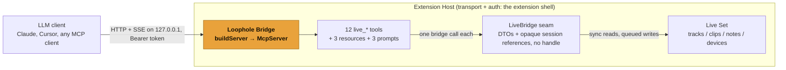

<p align="center">
  
</p>

<p align="center">
  <a href="https://github.com/OthmanAdi/loophole/actions/workflows/ci.yml"></a>
  <a href="https://modelcontextprotocol.io"></a>
  <a href="../../LICENSE"></a>
</p>

**`@othmanadi/loophole-core`'s sibling: the Loophole Bridge is the MCP server that lets an LLM read and edit a Live Set through the same official API the Loophole Kit uses.** It is the transport-agnostic, SDK-free package: you give `buildServer` a `LiveBridge` and connect the returned server to a transport. Inside Live, that transport is loopback HTTP and the bridge runs in the Extension Host, which makes Loophole **the first MCP server built on Ableton's official Extensions SDK** (the one "first" Loophole claims; the [prior art](../../README.md#built-on-and-prior-art) is credited in the root README).

The library exposes 12 deterministic `live_*` tools, 3 read-only resources, 3 recipe prompts, a typed error model with recovery hints, and a serialized mutation boundary. It has zero Ableton SDK in it by design, so the server can be exercised against a deterministic fake with no Ableton present.

The unit and in-process MCP integration suites run without Ableton. They cover the server contract, not Extension Host loading, the loopback listener, real client connectivity, SDK mutations, or Live undo history. Those gates remain `NOT_RUN` until evidence is recorded in the [E2E checklist](../extension/E2E_CHECKLIST.md). This package is an unpublished library with no supported executable or CLI.

---

## How it works

The bridge is transport-agnostic on purpose. `buildServer(bridge)` returns a configured `McpServer` and stops there: it opens no socket and imports no `node:http`. The caller chooses the transport. In Live, the [extension shell](../extension) constructs a Streamable HTTP transport on loopback inside the Extension Host and calls `server.connect(...)`; in CI, the tests connect an in-memory transport to the same server. The tools never see a socket, a token, or an SDK handle: they speak only the `LiveBridge` seam from [`@othmanadi/loophole-core`](../core).


```mermaid
flowchart LR
    client["LLM client<br/>Claude, Cursor, any MCP client"]
    subgraph host["Extension Host (transport + auth: the extension shell)"]
        server["Loophole Bridge<br/>buildServer → McpServer"]
        tools["12 live_* tools<br/>+ 3 resources + 3 prompts"]
        seam["LiveBridge seam<br/>DTOs + opaque session references, no handle"]
        set["Live Set<br/>tracks / clips / notes / devices"]
        server --> tools
        tools -- "one bridge call each" --> seam
        seam -- "sync reads, queued writes" --> set
    end
    client -- "HTTP + SSE on 127.0.0.1, Bearer token" --> server
    classDef accent fill:#E9A23B,stroke:#9A6A1A,color:#160F02,font-weight:bold;
    class server accent;
```

The loopback bind, the `Origin` check, and the bearer token shown on that edge are enforced by the extension shell when it mounts the server (see [security](#security)), not by this package. What lives here is everything from the `McpServer` inward.

---

## `buildServer`

One function is the whole public surface. It takes a `LiveBridge`, registers the 12 tools (each wrapped so it can never throw to the protocol), the 3 resources, and the 3 prompts, and returns the server ready to connect.

```ts
import { buildServer, type LiveBridge } from "@othmanadi/ableton-mcp";
import { StreamableHTTPServerTransport } from "@modelcontextprotocol/sdk/server/streamableHttp.js";

const bridge: LiveBridge = /* AbletonLiveBridge in Live, FakeLiveBridge in tests */;
const server = buildServer(bridge);

const transport = new StreamableHTTPServerTransport({ sessionIdGenerator: undefined });
await server.connect(transport); // the caller owns the transport; the bridge does not
```

`buildServer` is built purely from the `LiveBridge` port, so the exact same server code runs against `FakeLiveBridge` in CI and against the real `AbletonLiveBridge` adapter in Live. The package re-exports the `LiveBridge` type, so a consumer can type its implementation against `@othmanadi/ableton-mcp` without depending on `core` directly.

---

## The 12 tools

Every tool is a deterministic command: a Zod-validated input, finite and domain-checked numeric values, one defined operation, and a structured result. `NaN`, infinities, invalid ranges, and non-positive durations fail before reaching the bridge. The model decides which tool to call and with what arguments; it never touches Live directly. Reads come first, then writes, grouped by domain. Tool annotations describe protocol intent, but they do not replace the caller's confirmation or the Live-runtime checklist.

### Reads (4)

| Tool                     | Intent                                                                                                                                                   |
| ------------------------ | -------------------------------------------------------------------------------------------------------------------------------------------------------- |
| `live_get_song_overview` | One cheap snapshot of the Set: tempo, scale, grid, object counts, and track names with current opaque references. The first call in most sessions.       |
| `live_find_track`        | Resolve a human track description ("the bass") to current track matches and their opaque session references. An empty result is valid.                   |
| `live_list_clips`        | List the clips on one track (Session slots, including empties, plus Arrangement clips), each with its name, current opaque reference, and loop geometry. |
| `live_get_notes`         | Read all MIDI notes from one clip as plain note objects, so the model can reason about or transform them.                                                |

### Writes (8)

| Tool                    | Intent                                                                                                                                                                            |
| ----------------------- | --------------------------------------------------------------------------------------------------------------------------------------------------------------------------------- |
| `live_set_tempo`        | Set the Set tempo in BPM (20..999).                                                                                                                                               |
| `live_set_track_props`  | Rename, mute, solo, or arm the track identified by a current opaque reference.                                                                                                    |
| `live_set_notes`        | Replace all MIDI notes in one clip (the read-map-assign-back contract). Pitch and velocity clamp to 0..127, matching how Live rejects out-of-range values.                        |
| `live_create_track`     | Add one empty MIDI or audio track. Naming it is a separate call and therefore a separate mutation.                                                                                |
| `live_create_midi_clip` | Create an empty MIDI clip in a Session clip slot, ready for `live_set_notes`.                                                                                                     |
| `live_set_param`        | Set one device parameter to a value within its own `min..max`.                                                                                                                    |
| `live_insert_device`    | Insert a built-in Live device onto a track. Built-in devices only; third-party and VST are unsupported. Returns current opaque parameter references for `live_set_param`.         |
| `live_render_track`     | Render a track's pre-FX audio over a beat range to a WAV in the temp directory, and return the path. This writes a file; it does not change the Set, so there is nothing to undo. |

Tool inputs and outputs are described in the repository's [generated tool reference](../../docs/src/content/docs/mcp/tools.mdx), which is produced from the built server's own tool dump.

---

## Resources (3)

Read-only resources give the model cheap, browsable context without enlarging the tool list. All three return JSON with opaque session references, never SDK handles. They are backed by the same `LiveBridge` read methods as the read tools.

| Resource                           | Returns                                                                                                  |
| ---------------------------------- | -------------------------------------------------------------------------------------------------------- |
| `ableton://song`                   | The overview snapshot: tempo, scale, grid, object counts, and tracks with current references.            |
| `ableton://track/{reference}`      | One track's clips and device parameters. Use a current track reference as the one encoded URI component. |
| `ableton://clip/{reference}/notes` | One MIDI clip's notes. Use a current clip reference as the one encoded URI component.                    |

Resources mirror the read tools deliberately, so the model can pull `ableton://song` as context and escalate to a tool only when it needs to act or needs a filtered read. Unlike tools, resources carry no `safeHandle` wrapper: a stale or wrong-kind reference produces a normal resource-read failure, and the model falls back to the equivalent read tool, which carries a recovery hint.

---

## Prompts (3)

A small set of MCP prompts includes the cookbook operations as reusable, parameterized scaffolds. They are templates that compose the 12 tools, not new capability. There is **no Sampling**: the server never asks the client to run a model on its behalf.

| Prompt                          | Scaffolds                                                                                                                                                |
| ------------------------------- | -------------------------------------------------------------------------------------------------------------------------------------------------------- |
| `humanize_clip(clipId, amount)` | Read a clip's notes, nudge timing / velocity / probability slightly off the grid, write them back.                                                       |
| `build_arrangement(style?)`     | Survey the Set and propose a section order against the read tools. Forward-looking; the flagship [extension](../extension) implements the heavy version. |
| `batch_rename(pattern)`         | Find tracks by name, then apply a new name via `live_set_track_props`.                                                                                   |

---

## The error model

The rule the model needs: **a tool never throws to the protocol.** Every failure is a normal tool result with `isError: true` and a recovery hint, so the model self-corrects in one turn instead of seeing an opaque JSON-RPC error.

Every SDK-shaped failure reaches the tool layer as a typed `BridgeError` carrying a stable code and a recovery hint (the hint lives on the error; `core` populates a default per code). One wrapper, `safeHandle`, is the single place that catches and maps. The registry applies it to every handler at registration time, so no tool file knows it exists. It logs the full error to stderr (`ExtensionHost.txt` in Live) for the developer and returns a concise `{ isError: true }` to the model. The five codes:

| Code              | Condition                                                                    | Recovery hint the model gets                                |
| ----------------- | ---------------------------------------------------------------------------- | ----------------------------------------------------------- |
| `STALE_REFERENCE` | An opaque reference is expired or its object changed structurally            | Re-list with the matching read and use its fresh reference. |
| `WRONG_TYPE`      | A reference identifies the wrong object kind                                 | Use a reference from the matching list or read tool.        |
| `BAD_INPUT`       | An argument was out of range or malformed before any SDK call                | Fix the argument against the stated constraint and retry.   |
| `SDK_REJECTED`    | The host rejected a create / set / render, or the write queue is at capacity | Retry once; if it persists, simplify the request.           |
| `UNSUPPORTED`     | The operation is not available on this API version or object                 | Do not retry a different path; stop.                        |

`ok(data, summary)` returns both: a human-readable summary as text and the typed payload as `structuredContent`, so a model reads prose while a programmatic client consumes JSON. Both text bodies are capped (see [token discipline](#token-discipline)).

---

## Mutation and undo boundaries

Mutations serialize through one FIFO write queue. A simple setter is designed to initiate its writes in one SDK transaction. This is a code-level contract exercised against the fake; real Live undo history remains an unchecked E2E gate.

Two edges worth stating:

- **`live_render_track` is not a transaction.** It produces a WAV file and does not change the Set, so there is nothing to undo. It still goes through the queue so its I/O does not interleave with structural writes.
- **Create then configure uses two mutations.** The SDK must return the created object before follow-up configuration. Do not describe the combined operation as atomic.

The fake records intended transaction accounting. It does not prove how Live records undo entries. Record that evidence only after completing the [Live-runtime checklist](../extension/E2E_CHECKLIST.md).

---

## Token discipline

The server is built so a large Set never floods the model's context.

- **A 25,000-character cap on every tool and resource text payload.** On overflow, the body says so and tells the model how to narrow the read (a `trackId`, a beat range, `live_find_track`) rather than returning a silent partial dump.
- **Names and opaque session references, never handles.** Type tags include `lhref_trk`, `lhref_scn`, `lhref_cue`, `lhref_slot`, `lhref_clip`, `lhref_dev`, and `lhref_param`. A client passes a returned reference through unchanged, never invents or parses it, and re-lists after structural changes.
- **Summaries over dumps.** The overview returns counts and names, never every note in every clip; the reads default to one track or one clip at a time.

---

## Security

This package is transport-agnostic, so the network posture is enforced by the [extension shell](../extension) when it mounts the server in Live, not by `buildServer` itself. The model that the shell enforces:

- **Loopback bind.** The extension shell binds its listener to `127.0.0.1`, never `0.0.0.0`, so the shipped bridge is off the LAN by construction and exposes no host override.
- **Origin check (403 on mismatch).** A request whose `Origin` is a web origin not on the allow list is dropped before it reaches the server. This is the DNS-rebinding guard: a random browser tab cannot drive Live. Native MCP clients that send no `Origin` pass.
- **Bearer token (401 on mismatch).** On first activation the shell generates a random token, writes it to `bridge.json` in the extension's storage directory, and rejects any request without a matching `Authorization: Bearer` header. The human pastes the token into their client config once; the token is never in any tool output and never reaches the model.
- **No filesystem escape.** Render output goes to the temp directory; the bridge never exposes arbitrary read or write of the user's disk.

The in-package `config.ts` exports validated defaults for library consumers and supplies the result-size limit used by response helpers. The shipped listener's bind address, port probe, socket, auth gates, and `bridge.json` lifecycle are owned by the extension shell, so this library opens no transport and adds no auth assumptions to a consumer's tree. See the root [SECURITY.md](../../SECURITY.md) for the disclosure path.

---

## Testable without Live

The `LiveBridge` seam makes the server exercisable with no Ableton present. `FakeLiveBridge` supplies an in-memory Set with deterministic snapshots, queued mutations, validation, opaque-reference failures, and transaction accounting. It is a test double, not a substitute for Extension Host or undo-history evidence.

- **Unit tests:** Zod input validation, opaque-reference helpers, and typed error mapping.
- **In-process MCP integration:** a real MCP `Client` wired to `buildServer(FakeLiveBridge)` over `InMemoryTransport.createLinkedPair()`, with no sockets and no subprocess. The tests drive the server through `client.callTool(...)` and assert the MCP response and resulting fake state.
- **Inspector fixture:** `dist/cifake.js` wires the fake to stdio for repository contract checks. It is a test fixture, not a supported Loophole CLI or Live runtime.

The manual [Live-runtime checklist](../extension/E2E_CHECKLIST.md) is the separate step that needs real Ableton.

---

## Install from source

The package is not on npm yet, so install from the monorepo:

```bash
git clone https://github.com/OthmanAdi/loophole.git
cd loophole
pnpm install --frozen-lockfile --ignore-scripts
pnpm --filter @othmanadi/ableton-mcp test   # unit + in-process integration, no Ableton needed
pnpm --filter @othmanadi/ableton-mcp build   # tsup, inlines core into a self-contained bundle
```

Import `buildServer` from the workspace package as shown [above](#buildserver). `pnpm pack` produces a self-contained library tarball whose bundled output includes the core implementation. The repository's isolated consumer check installs only that tarball and verifies its exported server API. This remains artifact verification, not publication: there is no npm release, supported `npx` entry point, or supported standalone CLI. To exercise it inside Ableton, package the [extension](../extension) locally and follow every gate in the [E2E checklist](../extension/E2E_CHECKLIST.md).

---

Built by [Ahmad-Othman](https://github.com/OthmanAdi) (CodingWithAdi). License: [MIT](../../LICENSE).
