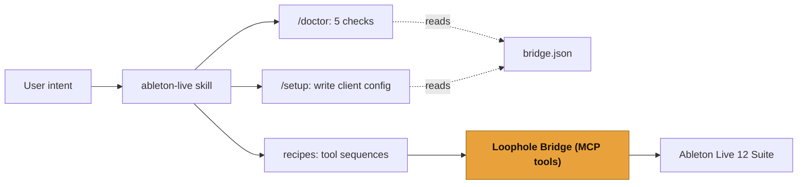

# ableton-live (alias: loophole)

A thin developer-experience layer for the Loophole Bridge, the MCP server that controls Ableton Live 12 over the official Extensions SDK. This skill closes the loop between "the bridge is installed" and "the agent uses it well." It does three things and nothing more.

It never talks to Live directly. It does not embed tool logic, re-implement the bridge, or import any bridge or SDK code. The bridge is the only thing that touches the Live Object Model. Every Live operation in this skill is a call to one of the bridge's MCP tools.

## What this skill does

1. **`/doctor`** runs five prerequisite checks (Live running, extension installed, Node version, bridge port reachable, token present) and prints a PASS or a specific FIX line for each, then one verdict. See `doctor.md`. It never auto-runs `/setup`.
2. **`/setup`** reads the port and bearer token the extension wrote to `bridge.json`, then emits the correct MCP client config for Claude Code, Claude Desktop, or Cursor. It never invents a port or token. See `setup.md`.
3. **Recipes** are reusable snippets for common Live edits, each a named sequence of real bridge tool calls. See `recipes/`: `humanize-midi`, `build-arrangement`, `batch-rename`, `chord-from-prompt`.

## How the pieces connect

The skill reads `bridge.json` (for `/doctor` and `/setup`) and issues MCP tool calls (for recipes). It does not reach past the bridge.

## The bridge tools the recipes use

The recipes reference only these registered MCP tools. No recipe invents a tool.

| Tool                     | Read or write | What it does                                                                       |
| ------------------------ | ------------- | ---------------------------------------------------------------------------------- |
| `live_get_song_overview` | read          | tempo, scale, grid, track and scene counts, track names with ids                   |
| `live_find_track`        | read          | resolve a track name or substring to a stable track id                             |
| `live_list_clips`        | read          | list a track's session slots (with empties) and arrangement clips, each with an id |
| `live_get_notes`         | read          | read all MIDI notes from one clip                                                  |
| `live_set_tempo`         | write         | set the Set tempo in BPM                                                           |
| `live_set_track_props`   | write         | set a track's name, mute, solo, or arm in one undo step                            |
| `live_set_notes`         | write         | replace all MIDI notes in one clip in one undo step                                |
| `live_create_track`      | write         | create one empty MIDI or audio track                                               |
| `live_create_midi_clip`  | write         | create an empty MIDI clip in a session clip slot                                   |
| `live_set_param`         | write         | set one device parameter by its id                                                 |
| `live_insert_device`     | write         | insert a built-in Live device on a track                                           |
| `live_render_track`      | write         | render a track's pre-FX audio over a beat range to a WAV                           |

## The one-undo rule (read before running any recipe)

Each bridge mutation is its own transaction, so **each tool call is one undo step**. This is per call, not per recipe. A recipe that calls `live_set_notes` once is one undo. A recipe that renames three tracks calls `live_set_track_props` three times and is three undo steps. A recipe that creates a clip and then fills it (`live_create_midi_clip` then `live_set_notes`) is two undo steps, because the bridge cannot create and populate inside one transaction. Each recipe states its own undo count. Do not promise a whole recipe reverts in a single undo.

## Beta limits the recipes inherit

These come from the bridge and extensions, not from the skill, and the recipes state them where they apply:

- MIDI notes only. No automation, MIDI CC, clip gain, or routing API in this beta.
- `live_create_midi_clip` targets session clip slots, not the Arrangement timeline. There is no Arrangement-write tool in the bridge. For a real Session-to-Arrangement build in one undo, the Session-to-Song extension (a `.ablx`) does that, not this skill.
- `live_insert_device` is built-in Live devices only (no third-party or VST).
- `live_render_track` is pre-FX and practical for audio tracks.
- Scale and tempo are read from the Set; the recipes do not guess a key. Assume 4/4 unless a scene signature is read.
- User-invoked only.
